# Sampling in Python

## Introduction to Sampling

### Simple sampling with pandas

Throughout this chapter, you'll be exploring song data from Spotify.
Each row of this population dataset represents a song, and there are
over 40,000 rows. Columns include the song name, the artists who
performed it, the release year, and attributes of the song like its
duration, tempo, and danceability. You'll start by looking at the
durations.

Your first task is to sample the Spotify dataset and compare the mean
duration of the population with the sample.

`spotify_population` is available and `pandas` is loaded as `pd`.

**Instructions**

- Sample 1000 rows from `spotify_population`, assigning to
  `spotify_sample`.
- Calculate the mean duration in minutes from `spotify_population` using `pandas`.
- Calculate the mean duration in minutes from `spotify_sample` using `pandas`.

**Answer**

```python
pip install pandas pyarrow
```

```python
# added/edited
import pandas as pd
spotify_population = pd.read_feather("spotify_2000_2020.feather")
```

```python
# Sample 1000 rows from spotify_population
spotify_sample = spotify_population.sample(n=1000)

# Print the sample
print(spotify_sample)

# Calculate the mean duration in mins from spotify_population
mean_dur_pop = spotify_population["duration_minutes"].mean()

# Calculate the mean duration in mins from spotify_sample
mean_dur_samp = spotify_sample["duration_minutes"].mean()

# Print the means
print(mean_dur_pop)
print(mean_dur_samp)
```

           acousticness                   artists  danceability  duration_ms  \
    2403        0.00037           ['The Rapture']         0.738     304739.0   
    3955        0.25900           ['Riley Green']         0.606     250253.0   
    38183       0.58000     ['Montez de Durango']         0.687     225173.0   
    11613       0.09450                ['Tyrese']         0.335     229320.0   
    25449       0.00024             ['Sevendust']         0.570     183400.0   
    ...             ...                       ...           ...          ...   
    39640       0.09890  ['DJ Quik', 'Suga Free']         0.845     250040.0   
    13402       0.40000                 ['Cabas']         0.716     237336.0   
    29199       0.04240                  ['P!nk']         0.742     298960.0   
    3218        0.01040           ['St. Vincent']         0.570     214987.0   
    35133       0.04200            ['Seth Ennis']         0.687     195418.0   
    
           duration_minutes  energy  explicit                      id  \
    2403           5.078983   0.764       0.0  0MrkkxbgfHfbxrTg12oHd4   
    3955           4.170883   0.455       0.0  3QE9qyQrIgefznSchAYJPB   
    38183          3.752883   0.425       0.0  3UtxfzWaBpi91suTUNw3jD   
    11613          3.822000   0.398       0.0  7m24jIM7r9LuzILUqO3zrA   
    25449          3.056667   0.990       1.0  1BU4ky3CgfqdYmSBfJeV9j   
    ...                 ...     ...       ...                     ...   
    39640          4.167333   0.618       1.0  3N3bbZga5ifQWxnzCrm3m2   
    13402          3.955600   0.552       0.0  6HNsJQihjxODgGWQafAJau   
    29199          4.982667   0.732       0.0  635PqgECfFbL0MNLogX7Yv   
    3218           3.583117   0.704       0.0  3j5DVpcCELigVZrmwGOw3X   
    35133          3.256967   0.625       0.0  7AK5vh1cRnO3YxAjOjL4Yy   
    
           instrumentalness  key  liveness  loudness  mode  \
    2403           0.278000  1.0    0.2920    -4.290   1.0   
    3955           0.000003  6.0    0.1590    -7.317   1.0   
    38183          0.000000  7.0    0.1180    -5.910   1.0   
    11613          0.000000  4.0    0.2650    -8.284   0.0   
    25449          0.000379  1.0    0.1110    -2.272   1.0   
    ...                 ...  ...       ...       ...   ...   
    39640          0.000000  4.0    0.1080    -6.516   0.0   
    13402          0.000000  9.0    0.2320    -8.316   1.0   
    29199          0.004440  2.0    0.1010    -6.046   0.0   
    3218           0.446000  1.0    0.0905    -8.320   1.0   
    35133          0.000000  1.0    0.1510    -6.942   0.0   
    
                                                        name  popularity  \
    2403                             House Of Jealous Lovers        43.0   
    3955                         When She Comes Home Tonight        60.0   
    38183                               Lágrimas Del Corazón        49.0   
    11613                                               Stay        43.0   
    25449                                              Enemy        53.0   
    ...                                                  ...         ...   
    39640  Do I Love Her? (feat. Suga Free) - Dirty Versi...        40.0   
    13402                                             Bonita        61.0   
    29199                                         Most Girls        53.0   
    3218                                               Cruel        50.0   
    35133                                        Look At You        63.0   
    
          release_date  speechiness    tempo  valence    year  
    2403    2003-01-01       0.0347  130.011    0.777  2003.0  
    3955    2018-06-01       0.0288  144.836    0.329  2018.0  
    38183   2007-01-01       0.0444  144.025    0.740  2007.0  
    11613   2011-01-01       0.0399   79.884    0.162  2011.0  
    25449   2003-10-07       0.0876  106.909    0.374  2003.0  
    ...            ...          ...      ...      ...     ...  
    39640         2000       0.3080   94.405    0.703  2000.0  
    13402   2008-04-01       0.0347  108.045    0.785  2008.0  
    29199   2000-04-04       0.0311   97.923    0.695  2000.0  
    3218    2011-09-12       0.0314  115.037    0.437  2011.0  
    35133   2017-08-11       0.0284  104.027    0.866  2017.0  
    
    [1000 rows x 20 columns]
    3.8521519140900073
    3.90690535

### Simple sampling and calculating with NumPy

You can also use `numpy` to calculate parameters or statistics from a
list or `pandas` Series.

You'll be turning it up to eleven and looking at the `loudness` property
of each song.

`spotify_population` is available and `numpy` is loaded as `np`.

**Instructions**

- Create a `pandas` Series, `loudness_pop`, by subsetting the `loudness`
  column from `spotify_population`.
- Sample `loudness_pop` to get 100 random values, assigning to
  `loudness_samp`.
- Calculate the mean of `loudness_pop` using `numpy`.
- Calculate the mean of `loudness_samp` using `numpy`.

**Answer**

```python
# added/edited
import numpy as np
```

```python
# Create a pandas Series from the loudness column of spotify_population
loudness_pop = spotify_population['loudness']

# Sample 100 values of loudness_pop
loudness_samp = loudness_pop.sample(n=100)

print(loudness_samp)


# Calculate the mean of loudness_pop
mean_loudness_pop = np.mean(loudness_pop)

# Calculate the mean of loudness_samp
mean_loudness_samp = np.mean(loudness_samp)

print(mean_loudness_pop)
print(mean_loudness_samp)
```

    11825    -4.056
    34198    -3.325
    25408    -2.762
    14628   -14.853
    36305    -3.707
              ...  
    39130    -4.283
    34263    -2.643
    18514    -5.797
    41454   -12.390
    11757    -7.087
    Name: loudness, Length: 100, dtype: float64
    -7.366856851353947
    -7.09517

### Are findings from the sample generalizable?

You just saw how convenience sampling—collecting data using the easiest
method—can result in samples that aren't representative of the
population. Equivalently, this means findings from the sample are not
generalizable to the population. Visualizing the distributions of the
population and the sample can help determine whether or not the sample
is representative of the population.

The Spotify dataset contains an `acousticness` column, which is a
confidence measure from zero to one of whether the track was made with
instruments that aren't plugged in. You'll compare the `acousticness`
distribution of the total population of songs with a sample of those
songs.

`spotify_population` and `spotify_mysterious_sample` are available;
`pandas` as `pd`, `matplotlib.pyplot` as `plt`, and `numpy` as `np` are
loaded.

**Instructions**

- Plot a histogram of the `acousticness` from `spotify_population` with
  bins of width `0.01` from `0` to `1` using pandas `.hist()`.
- Update the histogram code to use the `spotify_mysterious_sample` dataset.

**Answer**

```python
pip install matplotlib
```

```python
# added/edited
import matplotlib.pyplot as plt
spotify_mysterious_sample = spotify_population[spotify_population['acousticness'] > 0.95]
```

```python
# Visualize the distribution of acousticness with a histogram
spotify_population['acousticness'].hist(bins=np.arange(0, 1.01, 0.01))
plt.show()
```

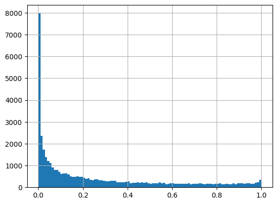

```python
# Update the histogram to use spotify_mysterious_sample
spotify_mysterious_sample['acousticness'].hist(bins=np.arange(0, 1.01, 0.01))
plt.show()
```

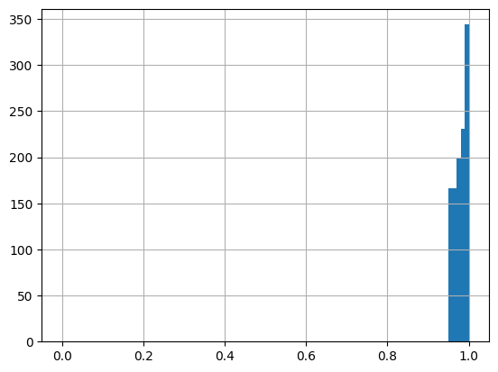

### Are these findings generalizable?

Let's look at another sample to see if it is representative of the
population. This time, you'll look at the `duration_minutes` column of
the Spotify dataset, which contains the length of the song in minutes.

`spotify_population` and `spotify_mysterious_sample2` are available;
`pandas`, `matplotlib.pyplot`, and `numpy` are loaded using their
standard aliases.

**Instructions**

- Plot a histogram of `duration_minutes` from `spotify_population` with
  bins of width `0.5` from `0` to `15` using pandas `.hist()`.
- Update the histogram code to use the `spotify_mysterious_sample2` dataset.

**Answer**

```python
# added/edited
spotify_mysterious_sample2 = spotify_population.sample(n=50)
```

```python
# Visualize the distribution of duration_minutes as a histogram
spotify_population['duration_minutes'].hist(bins=np.arange(0, 15.5, 0.5))
plt.show()
```

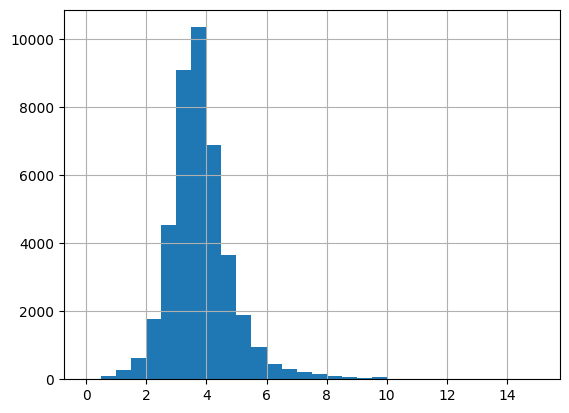

```python
# Update the histogram to use spotify_mysterious_sample2
spotify_mysterious_sample2['duration_minutes'].hist(bins=np.arange(0, 15.5, 0.5))
plt.show()
```

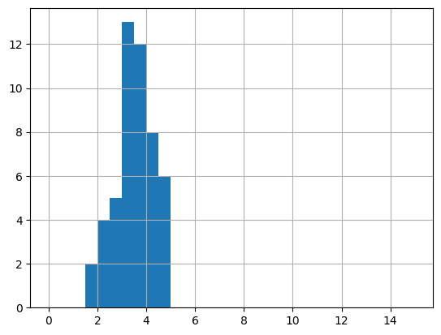

### Generating random numbers

You've used `.sample()` to generate pseudo-random numbers from a set of
values in a DataFrame. A related task is to generate random numbers that
follow a statistical distribution, like the uniform distribution or the
normal distribution.

Each random number generation function has distribution-specific
arguments and an argument for specifying the number of random numbers to
generate.

`matplotlib.pyplot` is loaded as `plt`, and `numpy` is loaded as `np`.

**Instructions**

- Generate 5000 numbers from a uniform distribution, setting the
  parameters `low` to `-3` and `high` to `3`.
- Generate 5000 numbers from a normal distribution, setting the parameters `loc` to `5` and `scale` to `2`.
- Plot a histogram of `uniforms` with bins of width of `0.25` from `-3` to `3` using `plt.hist()`.
- Plot a histogram of normals with bins of width of 0.5 from -2 to 13 using plt.hist().

**Answer**

```python
# Generate random numbers from a Uniform(-3, 3)
uniforms = np.random.uniform(low=-3, high=3, size=5000)

# Print uniforms
print(uniforms)


# Generate random numbers from a Normal(5, 2)
normals = np.random.normal(loc=5, scale=2, size=5000)

# Print normals
print(normals)
```

    [-2.94788158 -1.33044237 -1.27130426 ...  0.87379311  0.3151701
      1.58434735]
    [4.61215582 3.98134143 3.29329956 ... 5.74804703 4.0644388  5.2814828 ]

```python
# Generate random numbers from a Uniform(-3, 3)
uniforms = np.random.uniform(low=-3, high=3, size=5000)

# Plot a histogram of uniform values, binwidth 0.25
plt.hist(uniforms, bins=np.arange(-3, 3.25, 0.25))
plt.show()
```

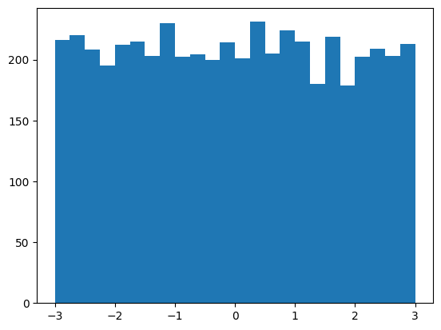

```python
# Generate random numbers from a Normal(5, 2)
normals = np.random.normal(loc=5, scale=2, size=5000)

# Plot a histogram of normal values, binwidth 0.5
plt.hist(normals, bins=np.arange(-2, 13.5, 0.5))
plt.show()
```

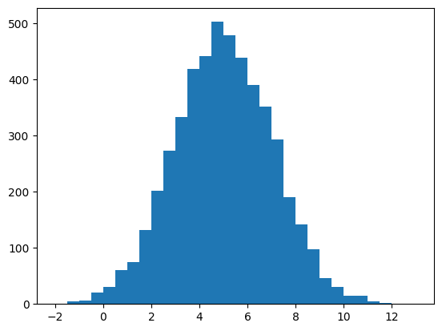

## Sampling Methods

### Simple random sampling

The simplest method of sampling a population is the one you've seen
already. It is known as *simple random sampling* (sometimes abbreviated
to "SRS"), and involves picking rows at random, one at a time, where
each row has the same chance of being picked as any other.

In this chapter, you'll apply sampling methods to a synthetic
(fictional) employee attrition dataset from IBM, where "attrition" in
this context means leaving the company.

`attrition_pop` is available; `pandas` as `pd` is loaded.

**Instructions**

- Sample 70 rows from `attrition_pop` using simple random sampling,
  setting the random seed to `18900217`.
- Print the sample dataset, `attrition_samp`. *What do you notice about
  the indices?*

**Answer**

```python
# added/edited
attrition_pop = pd.read_feather("attrition.feather")
```

```python
# Sample 70 rows using simple random sampling and set the seed
attrition_samp = attrition_pop.sample(n=70, random_state=18900217)

# Print the sample
print(attrition_samp)
```

          Age  Attrition     BusinessTravel  DailyRate            Department  \
    1134   35        0.0      Travel_Rarely        583  Research_Development   
    1150   52        0.0         Non-Travel        585                 Sales   
    531    33        0.0      Travel_Rarely        931  Research_Development   
    395    31        0.0      Travel_Rarely       1332  Research_Development   
    392    29        0.0      Travel_Rarely        942  Research_Development   
    ...   ...        ...                ...        ...                   ...   
    361    27        0.0  Travel_Frequently       1410                 Sales   
    1180   36        0.0      Travel_Rarely        530                 Sales   
    230    26        0.0      Travel_Rarely       1443                 Sales   
    211    29        0.0  Travel_Frequently        410  Research_Development   
    890    30        0.0  Travel_Frequently       1312  Research_Development   
    
          DistanceFromHome      Education    EducationField  \
    1134                25         Master           Medical   
    1150                29         Master     Life_Sciences   
    531                 14       Bachelor           Medical   
    395                 11        College           Medical   
    392                 15  Below_College     Life_Sciences   
    ...                ...            ...               ...   
    361                  3  Below_College           Medical   
    1180                 2         Master     Life_Sciences   
    230                 23       Bachelor         Marketing   
    211                  2  Below_College     Life_Sciences   
    890                  2         Master  Technical_Degree   
    
         EnvironmentSatisfaction  Gender  ...  PerformanceRating  \
    1134                    High  Female  ...          Excellent   
    1150                     Low    Male  ...          Excellent   
    531                Very_High  Female  ...          Excellent   
    395                     High    Male  ...          Excellent   
    392                   Medium  Female  ...          Excellent   
    ...                      ...     ...  ...                ...   
    361                Very_High  Female  ...        Outstanding   
    1180                    High  Female  ...          Excellent   
    230                     High  Female  ...          Excellent   
    211                Very_High  Female  ...          Excellent   
    890                Very_High  Female  ...          Excellent   
    
         RelationshipSatisfaction  StockOptionLevel TotalWorkingYears  \
    1134                     High                 1                16   
    1150                   Medium                 2                16   
    531                 Very_High                 1                 8   
    395                 Very_High                 0                 6   
    392                       Low                 1                 6   
    ...                       ...               ...               ...   
    361                    Medium                 2                 6   
    1180                     High                 0                17   
    230                      High                 1                 5   
    211                      High                 3                 4   
    890                 Very_High                 0                10   
    
         TrainingTimesLastYear WorkLifeBalance  YearsAtCompany  \
    1134                     3            Good              16   
    1150                     3            Good               9   
    531                      5          Better               8   
    395                      2            Good               6   
    392                      2            Good               5   
    ...                    ...             ...             ...   
    361                      3          Better               6   
    1180                     2            Good              13   
    230                      2            Good               2   
    211                      3          Better               3   
    890                      2          Better               9   
    
          YearsInCurrentRole  YearsSinceLastPromotion YearsWithCurrManager  
    1134                  10                       10                    1  
    1150                   8                        0                    0  
    531                    7                        1                    6  
    395                    5                        0                    1  
    392                    4                        1                    3  
    ...                  ...                      ...                  ...  
    361                    5                        0                    4  
    1180                   7                        6                    7  
    230                    2                        0                    0  
    211                    2                        0                    2  
    890                    7                        0                    7  
    
    [70 rows x 31 columns]

### Systematic sampling

One sampling method that avoids randomness is called *systematic
sampling*. Here, you pick rows from the population at regular intervals.

For example, if the population dataset had one thousand rows, and you
wanted a sample size of five, you could pick rows `0`, `200`, `400`,
`600`, and `800`.

`attrition_pop` is available; `pandas` has been pre-loaded as `pd`.

**Instructions**

- Set the sample size to `70`.
- Calculate the population size from `attrition_pop`.
- Calculate the interval between the rows to be sampled.
- Systematically sample `attrition_pop` to get the rows of the population at each `interval`, starting at 0; assign the rows to `attrition_sys_samp`.

**Answer**

```python
# Set the sample size to 70
sample_size = 70

# Calculate the population size from attrition_pop
pop_size = len(attrition_pop)

# Calculate the interval
interval = pop_size // sample_size

# Systematically sample 70 rows
attrition_sys_samp = attrition_pop.iloc[::interval]

# Print the sample
print(attrition_sys_samp)
```

          Age  Attrition BusinessTravel  DailyRate            Department  \
    0      21        0.0  Travel_Rarely        391  Research_Development   
    21     19        0.0  Travel_Rarely       1181  Research_Development   
    42     45        0.0  Travel_Rarely        252  Research_Development   
    63     23        0.0  Travel_Rarely        373  Research_Development   
    84     30        1.0  Travel_Rarely        945                 Sales   
    ...   ...        ...            ...        ...                   ...   
    1365   48        0.0  Travel_Rarely        715  Research_Development   
    1386   48        0.0  Travel_Rarely       1355  Research_Development   
    1407   50        0.0  Travel_Rarely        989  Research_Development   
    1428   50        0.0     Non-Travel        881  Research_Development   
    1449   52        0.0  Travel_Rarely        699  Research_Development   
    
          DistanceFromHome      Education EducationField EnvironmentSatisfaction  \
    0                   15        College  Life_Sciences                    High   
    21                   3  Below_College        Medical                  Medium   
    42                   2       Bachelor  Life_Sciences                  Medium   
    63                   1        College  Life_Sciences               Very_High   
    84                   9       Bachelor        Medical                  Medium   
    ...                ...            ...            ...                     ...   
    1365                 1       Bachelor  Life_Sciences               Very_High   
    1386                 4         Master  Life_Sciences                    High   
    1407                 7        College        Medical                  Medium   
    1428                 2         Master  Life_Sciences                     Low   
    1449                 1         Master  Life_Sciences                    High   
    
          Gender  ...  PerformanceRating RelationshipSatisfaction  \
    0       Male  ...          Excellent                Very_High   
    21    Female  ...          Excellent                Very_High   
    42    Female  ...          Excellent                Very_High   
    63      Male  ...        Outstanding                Very_High   
    84      Male  ...          Excellent                     High   
    ...      ...  ...                ...                      ...   
    1365    Male  ...          Excellent                     High   
    1386    Male  ...          Excellent                   Medium   
    1407  Female  ...          Excellent                Very_High   
    1428    Male  ...          Excellent                Very_High   
    1449    Male  ...          Excellent                      Low   
    
          StockOptionLevel TotalWorkingYears TrainingTimesLastYear  \
    0                    0                 0                     6   
    21                   0                 1                     3   
    42                   0                 1                     3   
    63                   1                 1                     2   
    84                   0                 1                     3   
    ...                ...               ...                   ...   
    1365                 0                25                     3   
    1386                 0                27                     3   
    1407                 1                29                     2   
    1428                 1                31                     3   
    1449                 1                34                     5   
    
         WorkLifeBalance  YearsAtCompany  YearsInCurrentRole  \
    0             Better               0                   0   
    21            Better               1                   0   
    42            Better               1                   0   
    63            Better               1                   0   
    84              Good               1                   0   
    ...              ...             ...                 ...   
    1365            Best               1                   0   
    1386          Better              15                  11   
    1407            Good              27                   3   
    1428          Better              31                   6   
    1449          Better              33                  18   
    
          YearsSinceLastPromotion YearsWithCurrManager  
    0                           0                    0  
    21                          0                    0  
    42                          0                    0  
    63                          0                    1  
    84                          0                    0  
    ...                       ...                  ...  
    1365                        0                    0  
    1386                        4                    8  
    1407                       13                    8  
    1428                       14                    7  
    1449                       11                    9  
    
    [70 rows x 31 columns]

### Is systematic sampling OK?

Systematic sampling has a problem: if the data has been sorted, or there
is some sort of pattern or meaning behind the row order, then the
resulting sample may not be representative of the whole population. The
problem can be solved by shuffling the rows, but then systematic
sampling is equivalent to simple random sampling.

Here you'll look at how to determine whether or not there is a problem.

`attrition_pop` is available; `pandas` is loaded as `pd`, and
`matplotlib.pyplot` as `plt`.

**Instructions**

- Add an index column to `attrition_pop`, assigning the result to
  `attrition_pop_id`.
- Create a scatter plot of `YearsAtCompany` versus `index` for
  `attrition_pop_id` using pandas `.plot()`.
- Randomly shuffle the rows of `attrition_pop`.
- Reset the row indexes, and add an index column to `attrition_pop`.
- Repeat the scatter plot of `YearsAtCompany` versus `index`, this time using `attrition_shuffled`.

**Answer**

```python
# Add an index column to attrition_pop
attrition_pop_id = attrition_pop.reset_index()

# Plot YearsAtCompany vs. index for attrition_pop_id
attrition_pop_id.plot(x="index", y="YearsAtCompany", kind="scatter")
plt.show()
```

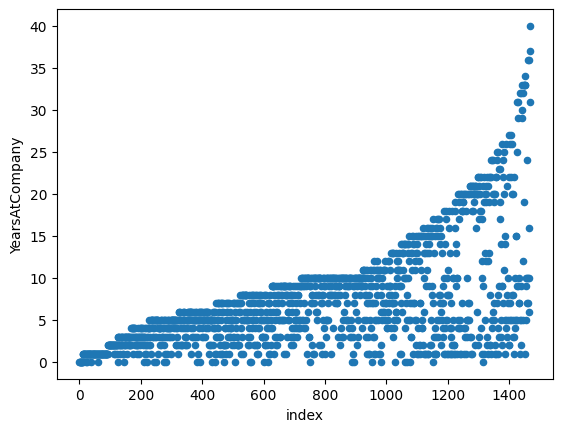

```python
# Shuffle the rows of attrition_pop
attrition_shuffled = attrition_pop.sample(frac=1)

# Reset the row indexes and create an index column
attrition_shuffled = attrition_shuffled.reset_index(drop=True).reset_index()

# Plot YearsAtCompany vs. index for attrition_shuffled
attrition_shuffled.plot(x="index", y="YearsAtCompany", kind="scatter")
plt.show()
```

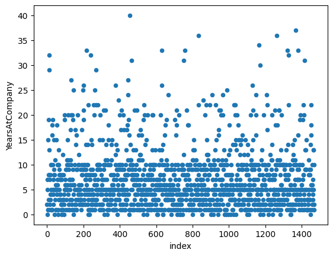

### Proportional stratified sampling

If you are interested in subgroups within the population, then you may
need to carefully control the counts of each subgroup within the
population. *Proportional stratified sampling* results in subgroup sizes
within the sample that are representative of the subgroup sizes within
the population. It is equivalent to performing a simple random sample on
each subgroup.

`attrition_pop` is available; `pandas` is loaded with its usual alias.

**Instructions**

- Get the proportion of employees by `Education` level from
  `attrition_pop`.
- Use proportional stratified sampling on `attrition_pop` to sample 40% of each `Education` group, setting the seed to `2022`.
- Get the proportion of employees by `Education` level from `attrition_strat`.

**Answer**

```python
# Proportion of employees by Education level
education_counts_pop = attrition_pop['Education'].value_counts(normalize=True)

# Print education_counts_pop
print(education_counts_pop)
```

    Education
    Bachelor         0.389116
    Master           0.270748
    College          0.191837
    Below_College    0.115646
    Doctor           0.032653
    Name: proportion, dtype: float64

```python
# Proportional stratified sampling for 40% of each Education group
attrition_strat = attrition_pop.groupby('Education')\
 .sample(frac=0.4, random_state=2022)

# Print the sample
print(attrition_strat)
```

          Age  Attrition     BusinessTravel  DailyRate            Department  \
    1191   53        0.0      Travel_Rarely        238                 Sales   
    407    29        0.0  Travel_Frequently        995  Research_Development   
    1233   59        0.0  Travel_Frequently       1225                 Sales   
    366    37        0.0      Travel_Rarely        571  Research_Development   
    702    31        0.0  Travel_Frequently        163  Research_Development   
    ...   ...        ...                ...        ...                   ...   
    733    38        0.0  Travel_Frequently        653  Research_Development   
    1061   44        0.0  Travel_Frequently        602       Human_Resources   
    1307   41        0.0      Travel_Rarely       1276                 Sales   
    1060   33        0.0      Travel_Rarely        516  Research_Development   
    177    29        0.0      Travel_Rarely        738  Research_Development   
    
          DistanceFromHome      Education    EducationField  \
    1191                 1  Below_College           Medical   
    407                  2  Below_College     Life_Sciences   
    1233                 1  Below_College     Life_Sciences   
    366                 10  Below_College     Life_Sciences   
    702                 24  Below_College  Technical_Degree   
    ...                ...            ...               ...   
    733                 29         Doctor     Life_Sciences   
    1061                 1         Doctor   Human_Resources   
    1307                 2         Doctor     Life_Sciences   
    1060                 8         Doctor     Life_Sciences   
    177                  9         Doctor             Other   
    
         EnvironmentSatisfaction  Gender  ...  PerformanceRating  \
    1191               Very_High  Female  ...        Outstanding   
    407                      Low    Male  ...          Excellent   
    1233                     Low  Female  ...          Excellent   
    366                Very_High  Female  ...          Excellent   
    702                Very_High  Female  ...        Outstanding   
    ...                      ...     ...  ...                ...   
    733                Very_High  Female  ...          Excellent   
    1061                     Low    Male  ...          Excellent   
    1307                  Medium  Female  ...          Excellent   
    1060               Very_High    Male  ...          Excellent   
    177                   Medium    Male  ...          Excellent   
    
         RelationshipSatisfaction  StockOptionLevel TotalWorkingYears  \
    1191                Very_High                 0                18   
    407                 Very_High                 1                 6   
    1233                Very_High                 0                20   
    366                    Medium                 2                 6   
    702                 Very_High                 0                 9   
    ...                       ...               ...               ...   
    733                 Very_High                 0                10   
    1061                     High                 0                14   
    1307                   Medium                 1                22   
    1060                      Low                 0                14   
    177                      High                 0                 4   
    
         TrainingTimesLastYear WorkLifeBalance  YearsAtCompany  \
    1191                     2            Best              14   
    407                      0            Best               6   
    1233                     2            Good               4   
    366                      3            Good               5   
    702                      3            Good               5   
    ...                    ...             ...             ...   
    733                      2          Better              10   
    1061                     3          Better              10   
    1307                     2          Better              18   
    1060                     6          Better               0   
    177                      2          Better               3   
    
          YearsInCurrentRole  YearsSinceLastPromotion YearsWithCurrManager  
    1191                   7                        8                   10  
    407                    4                        1                    3  
    1233                   3                        1                    3  
    366                    3                        4                    3  
    702                    4                        1                    4  
    ...                  ...                      ...                  ...  
    733                    3                        9                    9  
    1061                   7                        0                    2  
    1307                  16                       11                    8  
    1060                   0                        0                    0  
    177                    2                        2                    2  
    
    [588 rows x 31 columns]


    /tmp/ipykernel_24176/385919107.py:2: FutureWarning: The default of observed=False is deprecated and will be changed to True in a future version of pandas. Pass observed=False to retain current behavior or observed=True to adopt the future default and silence this warning.
      attrition_strat = attrition_pop.groupby('Education')\

```python
# Calculate the Education level proportions from attrition_strat
education_counts_strat = attrition_strat['Education'].value_counts(normalize=True)

# Print education_counts_strat
print(education_counts_strat)
```

    Education
    Bachelor         0.389456
    Master           0.270408
    College          0.192177
    Below_College    0.115646
    Doctor           0.032313
    Name: proportion, dtype: float64

### Equal counts stratified sampling

If one subgroup is larger than another subgroup in the population, but
you don't want to reflect that difference in your analysis, then you can
use *equal counts stratified sampling* to generate samples where each
subgroup has the same amount of data. For example, if you are analyzing
blood types, O is the most common blood type worldwide, but you may wish
to have equal amounts of O, A, B, and AB in your sample.

`attrition_pop` is available; `pandas` is loaded with its usual alias.

**Instructions**

- Use equal counts stratified sampling on `attrition_pop` to get 30
  employees from each `Education` group, setting the seed to `2022`.
- Get the proportion of employees by `Education` level from `attrition_eq`.

**Answer**

```python
# Get 30 employees from each Education group
attrition_eq = attrition_pop.groupby('Education')\
 .sample(n=30, random_state=2022)

# Print the sample
print(attrition_eq)
```

          Age  Attrition     BusinessTravel  DailyRate            Department  \
    1191   53        0.0      Travel_Rarely        238                 Sales   
    407    29        0.0  Travel_Frequently        995  Research_Development   
    1233   59        0.0  Travel_Frequently       1225                 Sales   
    366    37        0.0      Travel_Rarely        571  Research_Development   
    702    31        0.0  Travel_Frequently        163  Research_Development   
    ...   ...        ...                ...        ...                   ...   
    774    33        0.0      Travel_Rarely        922  Research_Development   
    869    45        0.0      Travel_Rarely       1015  Research_Development   
    530    32        0.0      Travel_Rarely        120  Research_Development   
    1049   48        0.0      Travel_Rarely        163                 Sales   
    350    29        1.0      Travel_Rarely        408  Research_Development   
    
          DistanceFromHome      Education    EducationField  \
    1191                 1  Below_College           Medical   
    407                  2  Below_College     Life_Sciences   
    1233                 1  Below_College     Life_Sciences   
    366                 10  Below_College     Life_Sciences   
    702                 24  Below_College  Technical_Degree   
    ...                ...            ...               ...   
    774                  1         Doctor           Medical   
    869                  5         Doctor           Medical   
    530                  6         Doctor     Life_Sciences   
    1049                 2         Doctor         Marketing   
    350                 25         Doctor  Technical_Degree   
    
         EnvironmentSatisfaction  Gender  ...  PerformanceRating  \
    1191               Very_High  Female  ...        Outstanding   
    407                      Low    Male  ...          Excellent   
    1233                     Low  Female  ...          Excellent   
    366                Very_High  Female  ...          Excellent   
    702                Very_High  Female  ...        Outstanding   
    ...                      ...     ...  ...                ...   
    774                      Low  Female  ...          Excellent   
    869                     High  Female  ...          Excellent   
    530                     High    Male  ...        Outstanding   
    1049                  Medium  Female  ...          Excellent   
    350                     High  Female  ...          Excellent   
    
         RelationshipSatisfaction  StockOptionLevel TotalWorkingYears  \
    1191                Very_High                 0                18   
    407                 Very_High                 1                 6   
    1233                Very_High                 0                20   
    366                    Medium                 2                 6   
    702                 Very_High                 0                 9   
    ...                       ...               ...               ...   
    774                      High                 1                10   
    869                       Low                 0                10   
    530                       Low                 0                 8   
    1049                      Low                 1                14   
    350                    Medium                 0                 6   
    
         TrainingTimesLastYear WorkLifeBalance  YearsAtCompany  \
    1191                     2            Best              14   
    407                      0            Best               6   
    1233                     2            Good               4   
    366                      3            Good               5   
    702                      3            Good               5   
    ...                    ...             ...             ...   
    774                      2          Better               6   
    869                      3          Better              10   
    530                      2          Better               5   
    1049                     2          Better               9   
    350                      2            Best               2   
    
          YearsInCurrentRole  YearsSinceLastPromotion YearsWithCurrManager  
    1191                   7                        8                   10  
    407                    4                        1                    3  
    1233                   3                        1                    3  
    366                    3                        4                    3  
    702                    4                        1                    4  
    ...                  ...                      ...                  ...  
    774                    1                        0                    5  
    869                    7                        1                    4  
    530                    4                        1                    4  
    1049                   7                        6                    7  
    350                    2                        1                    1  
    
    [150 rows x 31 columns]


    /tmp/ipykernel_24176/38261059.py:2: FutureWarning: The default of observed=False is deprecated and will be changed to True in a future version of pandas. Pass observed=False to retain current behavior or observed=True to adopt the future default and silence this warning.
      attrition_eq = attrition_pop.groupby('Education')\

```python
# Get the proportions from attrition_eq
education_counts_eq = attrition_eq['Education'].value_counts(normalize=True)

# Print the results
print(education_counts_eq)
```

    Education
    Below_College    0.2
    College          0.2
    Bachelor         0.2
    Master           0.2
    Doctor           0.2
    Name: proportion, dtype: float64

### Weighted sampling

Stratified sampling provides rules about the probability of picking rows
from your dataset at the subgroup level. A generalization of this is
*weighted sampling*, which lets you specify rules about the probability
of picking rows at the row level. The probability of picking any given
row is proportional to the weight value for that row.

`attrition_pop` is available; `pandas`, `matplotlib.pyplot`, and `numpy`
are loaded with their usual aliases.

**Instructions**

- Plot `YearsAtCompany` from `attrition_pop` as a histogram with bins of
  width `1` from `0` to `40`.
- Sample 400 employees from `attrition_pop` weighted by `YearsAtCompany`.
- Plot `YearsAtCompany` from `attrition_weight` as a histogram with bins of width `1` from `0` to `40`.

**Answer**

```python
# Plot YearsAtCompany from attrition_pop as a histogram
attrition_pop['YearsAtCompany'].hist(bins=np.arange(0, 41, 1))
plt.show()
```

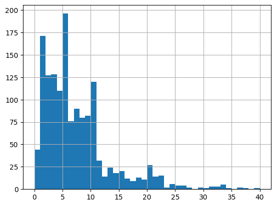

```python
# Sample 400 employees weighted by YearsAtCompany
attrition_weight = attrition_pop.sample(n=400, weights="YearsAtCompany")

# Print the sample
print(attrition_weight)
```

          Age  Attrition     BusinessTravel  DailyRate            Department  \
    1140   34        0.0  Travel_Frequently        829  Research_Development   
    234    28        0.0         Non-Travel        120                 Sales   
    1232   55        0.0      Travel_Rarely        836  Research_Development   
    392    29        0.0      Travel_Rarely        942  Research_Development   
    1274   39        0.0  Travel_Frequently       1218  Research_Development   
    ...   ...        ...                ...        ...                   ...   
    1440   50        0.0  Travel_Frequently        333  Research_Development   
    1038   31        0.0      Travel_Rarely        196                 Sales   
    1124   36        0.0      Travel_Rarely       1396  Research_Development   
    502    36        0.0      Travel_Rarely        559  Research_Development   
    902    31        0.0      Travel_Rarely        311  Research_Development   
    
          DistanceFromHome      Education    EducationField  \
    1140                15       Bachelor           Medical   
    234                  4       Bachelor           Medical   
    1232                 2         Master  Technical_Degree   
    392                 15  Below_College     Life_Sciences   
    1274                 1  Below_College     Life_Sciences   
    ...                ...            ...               ...   
    1440                22         Doctor           Medical   
    1038                29         Master         Marketing   
    1124                 5        College     Life_Sciences   
    502                 12         Master     Life_Sciences   
    902                 20       Bachelor     Life_Sciences   
    
         EnvironmentSatisfaction  Gender  ...  PerformanceRating  \
    1140                  Medium    Male  ...          Excellent   
    234                   Medium    Male  ...          Excellent   
    1232                  Medium    Male  ...        Outstanding   
    392                   Medium  Female  ...          Excellent   
    1274                  Medium    Male  ...          Excellent   
    ...                      ...     ...  ...                ...   
    1440                    High    Male  ...          Excellent   
    1038                     Low  Female  ...          Excellent   
    1124               Very_High    Male  ...          Excellent   
    502                     High  Female  ...          Excellent   
    902                   Medium    Male  ...          Excellent   
    
         RelationshipSatisfaction  StockOptionLevel TotalWorkingYears  \
    1140                Very_High                 2                16   
    234                    Medium                 0                 5   
    1232                   Medium                 1                19   
    392                       Low                 1                 6   
    1274                     High                 1                21   
    ...                       ...               ...               ...   
    1440                Very_High                 0                32   
    1038                      Low                 2                13   
    1124                Very_High                 0                16   
    502                    Medium                 2                 7   
    902                       Low                 1                10   
    
         TrainingTimesLastYear WorkLifeBalance  YearsAtCompany  \
    1140                     3            Good              14   
    234                      3            Best               5   
    1232                     2            Best               5   
    392                      2            Good               5   
    1274                     3          Better              21   
    ...                    ...             ...             ...   
    1440                     2          Better              32   
    1038                     3          Better              12   
    1124                     3            Best              13   
    502                      2          Better               3   
    902                      2          Better              10   
    
          YearsInCurrentRole  YearsSinceLastPromotion YearsWithCurrManager  
    1140                   8                        6                    9  
    234                    4                        0                    4  
    1232                   2                        0                    4  
    392                    4                        1                    3  
    1274                   8                        1                    6  
    ...                  ...                      ...                  ...  
    1440                   6                       13                    9  
    1038                   7                        5                    7  
    1124                  11                        3                    7  
    502                    2                        1                    1  
    902                    8                        0                    2  
    
    [400 rows x 31 columns]

```python
# Plot YearsAtCompany from attrition_weight as a histogram
attrition_weight['YearsAtCompany'].hist(bins=np.arange(0, 41, 1))
plt.show()
```

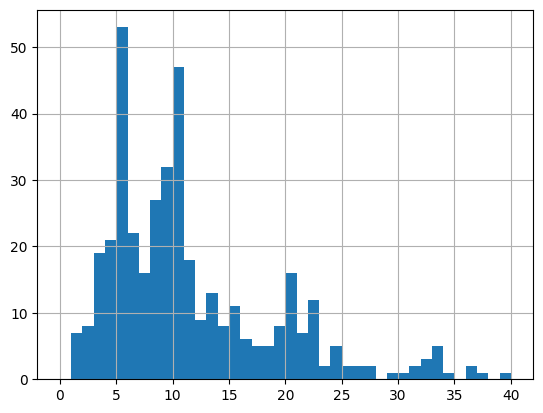

### Performing cluster sampling

Now that you know when to use cluster sampling, it's time to put it into
action. In this exercise, you'll explore the `JobRole` column of the
attrition dataset. You can think of each job role as a subgroup of the
whole population of employees.

`attrition_pop` is available; `pandas` is loaded with its usual alias,
and the `random` package is available. A seed of `19790801` has also
been set with `random.seed()`.

**Instructions**

- Create a list of unique `JobRole` values from `attrition_pop`, and
  assign to `job_roles_pop`.
- Randomly sample four `JobRole` values from `job_roles_pop`.
- Subset `attrition_pop` for the sampled job roles by filtering for rows where `JobRole` is in `job_roles_samp`.
- Remove any unused categories from `JobRole`.
- For each job role in the filtered dataset, take a random sample of ten rows, setting the seed to `2022`.

**Answer**

```python
# added/edited
import random
```

```python
# Create a list of unique JobRole values
job_roles_pop = list(attrition_pop['JobRole'].unique())

# Randomly sample four JobRole values
job_roles_samp = random.sample(job_roles_pop, k=4)

# Print the result
print(job_roles_samp)
```

    ['Manager', 'Manufacturing_Director', 'Human_Resources', 'Laboratory_Technician']

```python
# Filter for rows where JobRole is in job_roles_samp
jobrole_condition = attrition_pop['JobRole'].isin(job_roles_samp)
attrition_filtered = attrition_pop[jobrole_condition]

# Print the result
print(attrition_filtered)
```

          Age  Attrition BusinessTravel  DailyRate            Department  \
    2      18        1.0  Travel_Rarely        230  Research_Development   
    7      18        1.0     Non-Travel        247  Research_Development   
    8      18        0.0     Non-Travel       1124  Research_Development   
    11     30        0.0  Travel_Rarely       1358  Research_Development   
    12     22        0.0     Non-Travel       1123  Research_Development   
    ...   ...        ...            ...        ...                   ...   
    1462   54        0.0  Travel_Rarely        584  Research_Development   
    1463   56        0.0  Travel_Rarely       1400  Research_Development   
    1464   55        0.0  Travel_Rarely        452  Research_Development   
    1465   55        0.0  Travel_Rarely       1117                 Sales   
    1466   58        0.0     Non-Travel        350                 Sales   
    
          DistanceFromHome      Education EducationField EnvironmentSatisfaction  \
    2                    3       Bachelor  Life_Sciences                    High   
    7                    8  Below_College        Medical                    High   
    8                    1       Bachelor  Life_Sciences               Very_High   
    11                  24  Below_College  Life_Sciences               Very_High   
    12                  16        College        Medical               Very_High   
    ...                ...            ...            ...                     ...   
    1462                22         Doctor        Medical                  Medium   
    1463                 7       Bachelor  Life_Sciences               Very_High   
    1464                 1       Bachelor        Medical               Very_High   
    1465                18         Doctor  Life_Sciences                     Low   
    1466                 2       Bachelor        Medical                  Medium   
    
          Gender  ...  PerformanceRating RelationshipSatisfaction  \
    2       Male  ...          Excellent                     High   
    7       Male  ...          Excellent                Very_High   
    8     Female  ...          Excellent                     High   
    11      Male  ...        Outstanding                   Medium   
    12      Male  ...          Excellent                   Medium   
    ...      ...  ...                ...                      ...   
    1462  Female  ...        Outstanding                     High   
    1463    Male  ...          Excellent                      Low   
    1464    Male  ...          Excellent                     High   
    1465  Female  ...        Outstanding                Very_High   
    1466    Male  ...        Outstanding                Very_High   
    
          StockOptionLevel TotalWorkingYears TrainingTimesLastYear  \
    2                    0                 0                     2   
    7                    0                 0                     0   
    8                    0                 0                     5   
    11                   1                 1                     2   
    12                   2                 1                     2   
    ...                ...               ...                   ...   
    1462                 1                36                     6   
    1463                 0                37                     3   
    1464                 0                37                     2   
    1465                 0                37                     2   
    1466                 1                37                     0   
    
         WorkLifeBalance  YearsAtCompany  YearsInCurrentRole  \
    2             Better               0                   0   
    7             Better               0                   0   
    8               Best               0                   0   
    11            Better               1                   0   
    12              Good               1                   0   
    ...              ...             ...                 ...   
    1462          Better              10                   8   
    1463            Good               6                   4   
    1464          Better              36                  10   
    1465          Better              10                   9   
    1466            Good              16                   9   
    
          YearsSinceLastPromotion YearsWithCurrManager  
    2                           0                    0  
    7                           0                    0  
    8                           0                    0  
    11                          0                    0  
    12                          0                    0  
    ...                       ...                  ...  
    1462                        4                    7  
    1463                        0                    2  
    1464                        4                   13  
    1465                        7                    7  
    1466                       14                   14  
    
    [558 rows x 31 columns]

```python
# Remove categories with no rows
attrition_filtered['JobRole'] = attrition_filtered['JobRole'].cat.remove_unused_categories()

# Randomly sample 10 employees from each sampled job role
attrition_clust = attrition_filtered.groupby("JobRole")\
    .sample(n=10, random_state=2022)

# Print the sample
print(attrition_clust)         
```

          Age  Attrition     BusinessTravel  DailyRate            Department  \
    1348   44        1.0      Travel_Rarely       1376       Human_Resources   
    886    41        0.0         Non-Travel        552       Human_Resources   
    983    39        0.0      Travel_Rarely        141       Human_Resources   
    88     27        1.0  Travel_Frequently       1337       Human_Resources   
    189    34        0.0      Travel_Rarely        829       Human_Resources   
    160    24        0.0  Travel_Frequently        897       Human_Resources   
    839    46        0.0      Travel_Rarely        991       Human_Resources   
    966    30        0.0      Travel_Rarely       1240       Human_Resources   
    162    28        0.0         Non-Travel        280       Human_Resources   
    1231   37        0.0      Travel_Rarely       1239       Human_Resources   
    599    33        0.0      Travel_Rarely       1099  Research_Development   
    620    40        0.0      Travel_Rarely        543  Research_Development   
    853    36        0.0      Travel_Rarely        172  Research_Development   
    159    23        0.0      Travel_Rarely        160  Research_Development   
    317    35        0.0      Travel_Rarely        809  Research_Development   
    815    32        0.0         Non-Travel       1109  Research_Development   
    80     22        1.0      Travel_Rarely       1294  Research_Development   
    335    52        0.0      Travel_Rarely       1323  Research_Development   
    19     20        1.0  Travel_Frequently        871  Research_Development   
    296    23        0.0      Travel_Rarely        507  Research_Development   
    1377   52        0.0      Travel_Rarely       1053  Research_Development   
    1416   58        0.0      Travel_Rarely        605                 Sales   
    1385   54        0.0  Travel_Frequently       1050  Research_Development   
    1317   40        0.0      Travel_Rarely       1137  Research_Development   
    1417   59        0.0         Non-Travel       1420       Human_Resources   
    1294   39        0.0         Non-Travel        105  Research_Development   
    1292   43        0.0      Travel_Rarely        823  Research_Development   
    1304   41        0.0      Travel_Rarely        334                 Sales   
    1429   55        0.0         Non-Travel        444  Research_Development   
    1442   52        0.0         Non-Travel        771                 Sales   
    932    31        0.0      Travel_Rarely       1232  Research_Development   
    1056   37        0.0      Travel_Rarely        977  Research_Development   
    821    29        0.0      Travel_Rarely        718  Research_Development   
    220    35        0.0      Travel_Rarely        219  Research_Development   
    1328   55        0.0  Travel_Frequently       1091  Research_Development   
    242    25        0.0      Travel_Rarely        685  Research_Development   
    1248   47        0.0  Travel_Frequently       1379  Research_Development   
    933    30        0.0      Travel_Rarely        317  Research_Development   
    855    45        0.0      Travel_Rarely       1448  Research_Development   
    1397   52        0.0      Travel_Rarely        319  Research_Development   
    
          DistanceFromHome      Education    EducationField  \
    1348                 1        College           Medical   
    886                  4       Bachelor   Human_Resources   
    983                  3       Bachelor   Human_Resources   
    88                  22       Bachelor   Human_Resources   
    189                  3        College   Human_Resources   
    160                 10       Bachelor           Medical   
    839                  1        College     Life_Sciences   
    966                  9       Bachelor   Human_Resources   
    162                  1        College     Life_Sciences   
    1231                 8        College             Other   
    599                  4         Master           Medical   
    620                  1         Master     Life_Sciences   
    853                  4         Master     Life_Sciences   
    159                  4  Below_College           Medical   
    317                 16       Bachelor           Medical   
    815                 29         Master           Medical   
    80                   8  Below_College           Medical   
    335                  2       Bachelor     Life_Sciences   
    19                   6       Bachelor     Life_Sciences   
    296                 20  Below_College     Life_Sciences   
    1377                 1        College     Life_Sciences   
    1416                21       Bachelor     Life_Sciences   
    1385                11         Master           Medical   
    1317                 1         Master     Life_Sciences   
    1417                 2         Master   Human_Resources   
    1294                 9       Bachelor     Life_Sciences   
    1292                 6       Bachelor           Medical   
    1304                 2         Master     Life_Sciences   
    1429                 2  Below_College           Medical   
    1442                 2         Master     Life_Sciences   
    932                  7         Master           Medical   
    1056                 1       Bachelor     Life_Sciences   
    821                  8  Below_College           Medical   
    220                 16        College             Other   
    1328                 2  Below_College     Life_Sciences   
    242                  1       Bachelor     Life_Sciences   
    1248                16         Master           Medical   
    933                  2       Bachelor     Life_Sciences   
    855                 29       Bachelor  Technical_Degree   
    1397                 3       Bachelor           Medical   
    
         EnvironmentSatisfaction  Gender  ...  PerformanceRating  \
    1348                  Medium    Male  ...          Excellent   
    886                     High    Male  ...          Excellent   
    983                     High  Female  ...          Excellent   
    88                       Low  Female  ...          Excellent   
    189                     High    Male  ...          Excellent   
    160                      Low    Male  ...          Excellent   
    839                Very_High  Female  ...          Excellent   
    966                     High    Male  ...          Excellent   
    162                     High    Male  ...          Excellent   
    1231                    High    Male  ...          Excellent   
    599                      Low  Female  ...          Excellent   
    620                      Low    Male  ...          Excellent   
    853                      Low    Male  ...          Excellent   
    159                     High  Female  ...          Excellent   
    317                      Low    Male  ...          Excellent   
    815                Very_High  Female  ...          Excellent   
    80                      High  Female  ...          Excellent   
    335                     High  Female  ...          Excellent   
    19                 Very_High  Female  ...          Excellent   
    296                      Low    Male  ...          Excellent   
    1377               Very_High    Male  ...          Excellent   
    1416               Very_High  Female  ...          Excellent   
    1385                  Medium  Female  ...        Outstanding   
    1317                     Low    Male  ...          Excellent   
    1417                    High  Female  ...        Outstanding   
    1294               Very_High    Male  ...          Excellent   
    1292                     Low  Female  ...          Excellent   
    1304               Very_High    Male  ...          Excellent   
    1429                    High    Male  ...          Excellent   
    1442                     Low    Male  ...          Excellent   
    932                     High  Female  ...          Excellent   
    1056               Very_High  Female  ...          Excellent   
    821                   Medium    Male  ...          Excellent   
    220                Very_High  Female  ...          Excellent   
    1328               Very_High    Male  ...          Excellent   
    242                      Low  Female  ...          Excellent   
    1248                    High    Male  ...          Excellent   
    933                     High  Female  ...        Outstanding   
    855                   Medium    Male  ...          Excellent   
    1397               Very_High    Male  ...          Excellent   
    
         RelationshipSatisfaction  StockOptionLevel TotalWorkingYears  \
    1348                Very_High                 1                24   
    886                    Medium                 1                10   
    983                      High                 1                12   
    88                        Low                 0                 1   
    189                      High                 1                 4   
    160                 Very_High                 1                 3   
    839                      High                 0                10   
    966                 Very_High                 0                12   
    162                    Medium                 1                 3   
    1231                     High                 0                19   
    599                 Very_High                 0                 8   
    620                      High                 2                 8   
    853                      High                 0                10   
    159                      High                 0                 3   
    317                      High                 1                 6   
    815                    Medium                 0                10   
    80                       High                 0                 1   
    335                    Medium                 0                 6   
    19                     Medium                 0                 1   
    296                    Medium                 0                 5   
    1377                   Medium                 1                26   
    1416                     High                 1                29   
    1385                      Low                 1                26   
    1317                      Low                 1                22   
    1417                Very_High                 1                30   
    1294                     High                 0                21   
    1292                Very_High                 0                21   
    1304                   Medium                 0                22   
    1429                   Medium                 0                31   
    1442                Very_High                 0                33   
    932                      High                 0                11   
    1056                   Medium                 1                14   
    821                      High                 1                10   
    220                 Very_High                 0                 4   
    1328                   Medium                 1                23   
    242                 Very_High                 2                 5   
    1248                     High                 0                20   
    933                      High                 0                11   
    855                 Very_High                 2                10   
    1397                     High                 0                28   
    
         TrainingTimesLastYear WorkLifeBalance  YearsAtCompany  \
    1348                     1          Better              20   
    886                      4          Better               3   
    983                      3             Bad               8   
    88                       2          Better               1   
    189                      1             Bad               3   
    160                      2          Better               2   
    839                      3            Best               7   
    966                      2             Bad              11   
    162                      2          Better               3   
    1231                     4            Good              10   
    599                      5          Better               5   
    620                      3            Good               1   
    853                      2            Good              10   
    159                      3             Bad               3   
    317                      5          Better               5   
    815                      2          Better               8   
    80                       6          Better               1   
    335                      3            Good               2   
    19                       5          Better               1   
    296                      2          Better               4   
    1377                     2            Good               9   
    1416                     2            Good               1   
    1385                     2          Better              14   
    1317                     3          Better              19   
    1417                     3          Better               3   
    1294                     3            Good               6   
    1292                     2          Better              16   
    1304                     2          Better              22   
    1429                     3            Best               9   
    1442                     2            Best              33   
    932                      2            Good              11   
    1056                     2            Good              14   
    821                      2            Good              10   
    220                      2          Better               3   
    1328                     4          Better               3   
    242                      3          Better               4   
    1248                     3            Best              19   
    933                      2          Better               5   
    855                      4            Best               3   
    1397                     4          Better               5   
    
          YearsInCurrentRole  YearsSinceLastPromotion YearsWithCurrManager  
    1348                   6                        3                    6  
    886                    2                        1                    2  
    983                    3                        3                    6  
    88                     0                        0                    0  
    189                    2                        0                    2  
    160                    2                        2                    1  
    839                    6                        5                    7  
    966                    9                        4                    7  
    162                    2                        2                    2  
    1231                   0                        4                    7  
    599                    4                        0                    2  
    620                    0                        0                    0  
    853                    4                        1                    8  
    159                    2                        1                    2  
    317                    4                        0                    3  
    815                    7                        7                    7  
    80                     0                        0                    0  
    335                    2                        2                    2  
    19                     0                        1                    0  
    296                    3                        1                    2  
    1377                   8                        7                    8  
    1416                   0                        0                    0  
    1385                   9                        1                   12  
    1317                   7                       11                   16  
    1417                   2                        2                    2  
    1294                   0                        1                    3  
    1292                  12                        6                   14  
    1304                  10                        0                    4  
    1429                   7                        6                    2  
    1442                   7                       15                   12  
    932                    9                        4                   10  
    1056                   8                        3                   11  
    821                    7                        1                    2  
    220                    2                        0                    2  
    1328                   2                        1                    2  
    242                    2                        1                    2  
    1248                  10                        2                    7  
    933                    4                        0                    2  
    855                    1                        1                    2  
    1397                   4                        0                    4  
    
    [40 rows x 31 columns]


    /tmp/ipykernel_24176/1642936327.py:2: SettingWithCopyWarning: 
    A value is trying to be set on a copy of a slice from a DataFrame.
    Try using .loc[row_indexer,col_indexer] = value instead
    
    See the caveats in the documentation: https://pandas.pydata.org/pandas-docs/stable/user_guide/indexing.html#returning-a-view-versus-a-copy
      attrition_filtered['JobRole'] = attrition_filtered['JobRole'].cat.remove_unused_categories()
    /tmp/ipykernel_24176/1642936327.py:5: FutureWarning: The default of observed=False is deprecated and will be changed to True in a future version of pandas. Pass observed=False to retain current behavior or observed=True to adopt the future default and silence this warning.
      attrition_clust = attrition_filtered.groupby("JobRole")\

### 3 kinds of sampling

You're going to compare the performance of point estimates using simple,
stratified, and cluster sampling. Before doing that, you'll have to set
up the samples.

You'll use the `RelationshipSatisfaction` column of the `attrition_pop`
dataset, which categorizes the employee's relationship with the company.
It has four levels: `Low`, `Medium`, `High`, and `Very_High`. `pandas`
has been loaded with its usual alias, and the `random` package has been
loaded.

**Instructions**

- Perform simple random sampling on `attrition_pop` to get one-quarter
  of the population, setting the seed to `2022`.

<!-- -->

- Perform stratified sampling on `attrition_pop` to sample one-quarter
  of each `RelationshipSatisfaction` group, setting the seed to `2022`.

<!-- -->

- Create a list of unique values from `attrition_pop`'s
  `RelationshipSatisfaction` column.
- Randomly sample `satisfaction_unique` to get two values.
- Subset the population for rows where `RelationshipSatisfaction` is in
  `satisfaction_samp` and clear any unused categories from
  `RelationshipSatisfaction`; assign to `attrition_clust_prep`.
- Perform cluster sampling on the selected satisfaction groups, sampling
  one quarter of the *population* and setting the seed to `2022`.

**Answer**

```python
# Perform simple random sampling to get 0.25 of the population
attrition_srs = attrition_pop.sample(frac=0.25, random_state=2022)
```

```python
# Perform stratified sampling to get 0.25 of each relationship group
attrition_strat = attrition_pop.groupby("RelationshipSatisfaction")\
    .sample(frac=0.25, random_state=2022)
```

    /tmp/ipykernel_24176/1183472179.py:2: FutureWarning: The default of observed=False is deprecated and will be changed to True in a future version of pandas. Pass observed=False to retain current behavior or observed=True to adopt the future default and silence this warning.
      attrition_strat = attrition_pop.groupby("RelationshipSatisfaction")\

```python
# Create a list of unique RelationshipSatisfaction values
satisfaction_unique = list(attrition_pop['RelationshipSatisfaction'].unique())

# Randomly sample 2 unique satisfaction values
satisfaction_samp = random.sample(satisfaction_unique, k=2)

# Filter for satisfaction_samp and clear unused categories from RelationshipSatisfaction
satis_condition = attrition_pop['RelationshipSatisfaction'].isin(satisfaction_samp)
attrition_clust_prep = attrition_pop[satis_condition]
attrition_clust_prep['RelationshipSatisfaction'] = attrition_clust_prep['RelationshipSatisfaction'].cat.remove_unused_categories()

# Perform cluster sampling on the selected group, getting 0.25 of attrition_pop
attrition_clust = attrition_clust_prep.groupby("RelationshipSatisfaction")\
    .sample(n=len(attrition_pop) // 4, random_state=2022)

```

    /tmp/ipykernel_24176/1225069142.py:10: SettingWithCopyWarning: 
    A value is trying to be set on a copy of a slice from a DataFrame.
    Try using .loc[row_indexer,col_indexer] = value instead
    
    See the caveats in the documentation: https://pandas.pydata.org/pandas-docs/stable/user_guide/indexing.html#returning-a-view-versus-a-copy
      attrition_clust_prep['RelationshipSatisfaction'] = attrition_clust_prep['RelationshipSatisfaction'].cat.remove_unused_categories()
    /tmp/ipykernel_24176/1225069142.py:13: FutureWarning: The default of observed=False is deprecated and will be changed to True in a future version of pandas. Pass observed=False to retain current behavior or observed=True to adopt the future default and silence this warning.
      attrition_clust = attrition_clust_prep.groupby("RelationshipSatisfaction")\

### Comparing point estimates

Now that you have three types of sample (simple, stratified, and
cluster), you can compare point estimates from each sample to the
population parameter. That is, you can calculate the same summary
statistic on each sample and see how it compares to the summary
statistic for the population.

Here, we'll look at how satisfaction with the company affects whether or
not the employee leaves the company. That is, you'll calculate the
proportion of employees who left the company (they have an `Attrition`
value of `1`) for each value of `RelationshipSatisfaction`.

`attrition_pop`, `attrition_srs`, `attrition_strat`, and
`attrition_clust` are available; `pandas` is loaded with its usual
alias.

**Instructions**

Group `attrition_pop` by `RelationshipSatisfaction` levels and calculate
the mean of `Attrition` for each level.

Calculate the proportion of employee attrition for each relationship
satisfaction group, this time on the simple random sample,
`attrition_srs`.

Calculate the proportion of employee attrition for each relationship
satisfaction group, this time on the stratified sample,
`attrition_strat`.

Calculate the proportion of employee attrition for each relationship
satisfaction group, this time on the cluster sample, `attrition_clust`.

**Answer**

```python
# Mean Attrition by RelationshipSatisfaction group
mean_attrition_pop = attrition_pop.groupby('RelationshipSatisfaction')['Attrition'].mean()

# Print the result
print(mean_attrition_pop)


# Calculate the same thing for the simple random sample 
mean_attrition_srs = attrition_srs.groupby('RelationshipSatisfaction')['Attrition'].mean()

# Print the result
print(mean_attrition_srs)


# Calculate the same thing for the stratified sample 
mean_attrition_strat = attrition_strat.groupby('RelationshipSatisfaction')['Attrition'].mean()

# Print the result
print(mean_attrition_strat)


# Calculate the same thing for the cluster sample 
mean_attrition_clust = attrition_clust.groupby('RelationshipSatisfaction')['Attrition'].mean()

# Print the result
print(mean_attrition_clust)
```

    RelationshipSatisfaction
    Low          0.206522
    Medium       0.148515
    High         0.154684
    Very_High    0.148148
    Name: Attrition, dtype: float64
    RelationshipSatisfaction
    Low          0.134328
    Medium       0.164179
    High         0.160000
    Very_High    0.155963
    Name: Attrition, dtype: float64
    RelationshipSatisfaction
    Low          0.144928
    Medium       0.078947
    High         0.165217
    Very_High    0.129630
    Name: Attrition, dtype: float64
    RelationshipSatisfaction
    High         0.149864
    Very_High    0.160763
    Name: Attrition, dtype: float64


    /tmp/ipykernel_24176/3036671708.py:2: FutureWarning: The default of observed=False is deprecated and will be changed to True in a future version of pandas. Pass observed=False to retain current behavior or observed=True to adopt the future default and silence this warning.
      mean_attrition_pop = attrition_pop.groupby('RelationshipSatisfaction')['Attrition'].mean()
    /tmp/ipykernel_24176/3036671708.py:9: FutureWarning: The default of observed=False is deprecated and will be changed to True in a future version of pandas. Pass observed=False to retain current behavior or observed=True to adopt the future default and silence this warning.
      mean_attrition_srs = attrition_srs.groupby('RelationshipSatisfaction')['Attrition'].mean()
    /tmp/ipykernel_24176/3036671708.py:16: FutureWarning: The default of observed=False is deprecated and will be changed to True in a future version of pandas. Pass observed=False to retain current behavior or observed=True to adopt the future default and silence this warning.
      mean_attrition_strat = attrition_strat.groupby('RelationshipSatisfaction')['Attrition'].mean()
    /tmp/ipykernel_24176/3036671708.py:23: FutureWarning: The default of observed=False is deprecated and will be changed to True in a future version of pandas. Pass observed=False to retain current behavior or observed=True to adopt the future default and silence this warning.
      mean_attrition_clust = attrition_clust.groupby('RelationshipSatisfaction')['Attrition'].mean()

## Sampling Distributions

### Calculating relative errors

The size of the sample you take affects how accurately the point
estimates reflect the corresponding population parameter. For example,
when you calculate a sample mean, you want it to be close to the
population mean. However, if your sample is too small, this might not be
the case.

The most common metric for assessing accuracy is *relative error*. This
is the absolute difference between the population parameter and the
point estimate, all divided by the population parameter. It is sometimes
expressed as a percentage.

`attrition_pop` and `mean_attrition_pop` (the mean of the `Attrition`
column of `attrition_pop`) are available; `pandas` is loaded as `pd`.

**Instructions**

- Generate a simple random sample from `attrition_pop` of fifty rows,
  setting the seed to `2022`.
- Calculate the mean employee `Attrition` in the sample.
- Calculate the relative error between `mean_attrition_srs50` and
  `mean_attrition_pop` as a *percentage*.

<!-- -->

- Calculate the *relative error percentage* again. This time, use a
  simple random sample of one hundred rows of `attrition_pop`.

**Answer**

```python
# added/edited
mean_attrition_pop = attrition_pop['Attrition'].mean()
```

```python
# Generate a simple random sample of 50 rows, with seed 2022
attrition_srs50 = attrition_pop.sample(n=50, random_state=2022)

# Calculate the mean employee attrition in the sample
mean_attrition_srs50 = attrition_srs50['Attrition'].mean()

# Calculate the relative error percentage
rel_error_pct50 = 100 * abs(mean_attrition_pop - mean_attrition_srs50) / mean_attrition_pop

# Print rel_error_pct50
print(rel_error_pct50)


# Generate a simple random sample of 100 rows, with seed 2022
attrition_srs100 = attrition_pop.sample(n=100, random_state=2022)

# Calculate the mean employee attrition in the sample
mean_attrition_srs100 = attrition_srs100['Attrition'].mean()

# Calculate the relative error percentage
rel_error_pct100 = 100 * abs(mean_attrition_pop - mean_attrition_srs100) / mean_attrition_pop

# Print rel_error_pct100
print(rel_error_pct100)

```

    62.78481012658227
    6.962025316455695

### Replicating samples

When you calculate a point estimate such as a sample mean, the value you
calculate depends on the rows that were included in the sample. That
means that there is some randomness in the answer. In order to quantify
the variation caused by this randomness, you can create many samples and
calculate the sample mean (or another statistic) for each sample.

`attrition_pop` is available; `pandas` and `matplotlib.pyplot` are
loaded with their usual aliases.

**Instructions**

- Replicate the provided code so that it runs `500` times. Assign the
  resulting list of sample means to `mean_attritions`.
- Draw a histogram of the `mean_attritions` list with 16 bins.

**Answer**

```python
# Create an empty list
mean_attritions = []
# Loop 500 times to create 500 sample means
for i in range(500):
 mean_attritions.append(
     attrition_pop.sample(n=60)['Attrition'].mean()
 )
  
# Print out the first few entries of the list
print(mean_attritions[0:5])
```

    [0.1, 0.13333333333333333, 0.18333333333333332, 0.21666666666666667, 0.2]

```python
# Create an empty list
mean_attritions = []
# Loop 500 times to create 500 sample means
for i in range(500):
 mean_attritions.append(
     attrition_pop.sample(n=60)['Attrition'].mean()
 )

# Create a histogram of the 500 sample means
plt.hist(mean_attritions, bins=16)
plt.show()

```

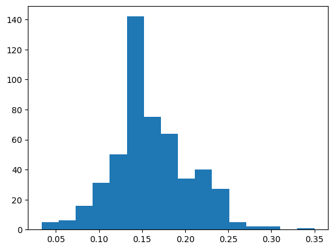

### Exact sampling distribution

To quantify how the point estimate (sample statistic) you are interested
in varies, you need to know all the possible values it can take and how
often. That is, you need to know its distribution.

The distribution of a sample statistic is called the *sampling
distribution*. When we can calculate this exactly, rather than using an
approximation, it is known as the *exact sampling distribution*.

Let's take another look at the sampling distribution of dice rolls. This
time, we'll look at five eight-sided dice. (These have the numbers one
to eight.)


`pandas`, `numpy`, and `matplotlib.pyplot` are loaded with their usual
aliases. The `expand_grid()` function is also available, which expects a
dictionary of key-value pairs as its argument. The definition of the
`expand_grid()` function is provided in the [pandas
documentation](https://pandas.pydata.org/pandas-docs/version/0.17.1/cookbook.html#creating-example-data).

**Instructions**

- Expand a grid representing 5 8-sided dice. That is, create a DataFrame
  with five columns from a dictionary, named `die1` to `die5`. The rows
  should contain all possibilities for throwing five dice, each numbered
  `1` to `8`.
- Add a column, `mean_roll`, to `dice`, that contains the mean of the five rolls as a categorical.
- Create a bar plot of the `mean_roll` categorical column, so it displays the count of each `mean_roll` in increasing order from `1.0` to `8.0`.

**Answer**

```python
# added/edited
import itertools
def expand_grid(data_dict):
    rows = itertools.product(*data_dict.values())
    return pd.DataFrame.from_records(rows, columns=data_dict.keys())
```

```python
# Expand a grid representing 5 8-sided dice
dice = expand_grid(
  {'die1': [1, 2, 3, 4, 5, 6, 7, 8],
   'die2': [1, 2, 3, 4, 5, 6, 7, 8],
   'die3': [1, 2, 3, 4, 5, 6, 7, 8],
   'die4': [1, 2, 3, 4, 5, 6, 7, 8],
   'die5': [1, 2, 3, 4, 5, 6, 7, 8]
  })

# Print the result
print(dice)
```

           die1  die2  die3  die4  die5
    0         1     1     1     1     1
    1         1     1     1     1     2
    2         1     1     1     1     3
    3         1     1     1     1     4
    4         1     1     1     1     5
    ...     ...   ...   ...   ...   ...
    32763     8     8     8     8     4
    32764     8     8     8     8     5
    32765     8     8     8     8     6
    32766     8     8     8     8     7
    32767     8     8     8     8     8
    
    [32768 rows x 5 columns]

```python
# Add a column of mean rolls and convert to a categorical
dice['mean_roll'] = (dice['die1'] + dice['die2'] + 
                     dice['die3'] + dice['die4'] + 
                     dice['die5']) / 5
dice['mean_roll'] = dice['mean_roll'].astype('category')

# Print result
print(dice)
```

           die1  die2  die3  die4  die5 mean_roll
    0         1     1     1     1     1       1.0
    1         1     1     1     1     2       1.2
    2         1     1     1     1     3       1.4
    3         1     1     1     1     4       1.6
    4         1     1     1     1     5       1.8
    ...     ...   ...   ...   ...   ...       ...
    32763     8     8     8     8     4       7.2
    32764     8     8     8     8     5       7.4
    32765     8     8     8     8     6       7.6
    32766     8     8     8     8     7       7.8
    32767     8     8     8     8     8       8.0
    
    [32768 rows x 6 columns]

```python
# Draw a bar plot of mean_roll
dice['mean_roll'].value_counts(sort=False).plot(kind="bar")
plt.show()
```

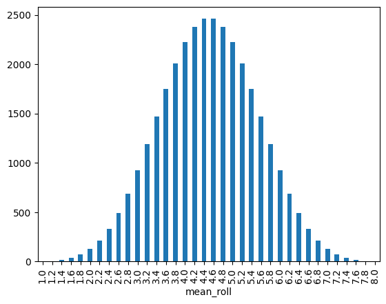

### Generating an approximate sampling distribution

Calculating the exact sampling distribution is only possible in very
simple situations. With just five eight-sided dice, the number of
possible rolls is `8**5`, which is over thirty thousand. When the
dataset is more complicated, for example, where a variable has hundreds
or thousands of categories, the number of possible outcomes becomes too
difficult to compute exactly.

In this situation, you can calculate an *approximate sampling
distribution* by simulating the exact sampling distribution. That is,
you can repeat a procedure over and over again to simulate both the
sampling process and the sample statistic calculation process.

`pandas`, `numpy`, and `matplotlib.pyplot` are loaded with their usual
aliases.

**Instructions**

- Sample one to eight, five times, with replacement. Assign to
  `five_rolls`.
- Calculate the mean of `five_rolls`.
- Replicate the sampling code 1000 times, assigning each result to the list `sample_means_1000`.
- Plot `sample_means_1000` as a histogram with `20` bins.

**Answer**

```python
# Sample one to eight, five times, with replacement
five_rolls = np.random.choice(list(range(1, 9)), size=5, replace=True)

# Print the mean of five_rolls
print(five_rolls.mean())


# Replicate the sampling code 1000 times
sample_means_1000 = []
for i in range(1000):
    sample_means_1000.append(
    np.random.choice(list(range(1, 9)), size=5, replace=True).mean()
    )

# Print the first 10 entries of the result
print(sample_means_1000[0:10])
```

    4.8
    [4.0, 4.2, 3.6, 5.8, 4.0, 3.0, 4.6, 5.6, 3.0, 4.8]

```python
# Draw a histogram of sample_means_1000 with 20 bins
plt.hist(sample_means_1000, bins=20)
plt.show()
```

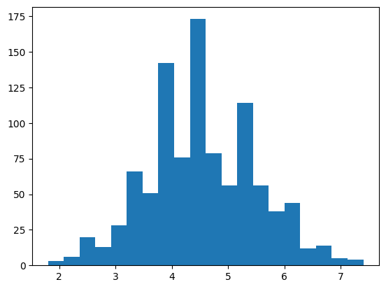

### Population & sampling distribution means

One of the useful features of sampling distributions is that you can
quantify them. Specifically, you can calculate summary statistics on
them. Here, you'll look at the relationship between the mean of the
sampling distribution and the population parameter's mean.

Three sampling distributions are provided. For each, the employee
attrition dataset was sampled using simple random sampling, then the
mean attrition was calculated. This was done 1000 times to get a
sampling distribution of mean attritions. One sampling distribution used
a sample size of 5 for each replicate, one used 50, and one used 500.

`attrition_pop`, `sampling_distribution_5`, `sampling_distribution_50`,
and `sampling_distribution_500` are available; `numpy` as `np` is
loaded.

**Instructions**

- Calculate the mean of `sampling_distribution_5`,
  `sampling_distribution_50`, and `sampling_distribution_500` (a mean of
  sample means).

**Answer**

```python
# added/edited
sampling_distribution_5 = [attrition_pop.sample(n=5)['Attrition'].mean() for _ in range(1000)]
sampling_distribution_50 = [attrition_pop.sample(n=50)['Attrition'].mean() for _ in range(1000)]
sampling_distribution_500 = [attrition_pop.sample(n=500)['Attrition'].mean() for _ in range(1000)]
```

```python
# Calculate the mean of the mean attritions for each sampling distribution
mean_of_means_5 = np.mean(sampling_distribution_5)
mean_of_means_50 = np.mean(sampling_distribution_50)
mean_of_means_500 = np.mean(sampling_distribution_500)

# Print the results
print(mean_of_means_5)
print(mean_of_means_50)
print(mean_of_means_500)
```

    0.15619999999999998
    0.16186
    0.161374

### Population & sampling distribution variation

You just calculated the mean of the sampling distribution and saw how it
is an estimate of the corresponding population parameter. Similarly, as
a result of the central limit theorem, the standard deviation of the
sampling distribution has an interesting relationship with the
population parameter's standard deviation and the sample size.

`attrition_pop`, `sampling_distribution_5`, `sampling_distribution_50`,
and `sampling_distribution_500` are available; `numpy` is loaded with
its usual alias.

**Instructions**

- Calculate the standard deviation of `sampling_distribution_5`,
  `sampling_distribution_50`, and `sampling_distribution_500` (a
  standard deviation of sample means).

**Answer**

```python
# Calculate the std. dev. of the mean attritions for each sampling distribution
sd_of_means_5 = np.std(sampling_distribution_5, ddof=1)
sd_of_means_50 = np.std(sampling_distribution_50, ddof=1)
sd_of_means_500 = np.std(sampling_distribution_500, ddof=1)

# Print the results
print(sd_of_means_5)
print(sd_of_means_50)
print(sd_of_means_500)
```

    0.15041337767693466
    0.05040914085244343
    0.013351493788576108

## Bootstrap Distributions

### Generating a bootstrap distribution

The process for generating a bootstrap distribution is similar to the
process for generating a sampling distribution; only the first step is
different.

To make a sampling distribution, you start with the population and
sample without replacement. To make a bootstrap distribution, you start
with a sample and sample that with replacement. After that, the steps
are the same: calculate the summary statistic that you are interested in
on that sample/resample, then replicate the process many times. In each
case, you can visualize the distribution with a histogram.

Here, `spotify_sample` is a subset of the `spotify_population` dataset.
To make it easier to see how resampling works, a row index column called
`'index'` has been added, and only the artist name, song name, and
`danceability` columns have been included.

`spotify_sample` is available; `pandas`, `numpy`, and
`matplotlib.pyplot` are loaded with their usual aliases.

**Instructions**

- Generate a single bootstrap resample from `spotify_sample`.
- Calculate the mean of the `danceability` column of `spotify_1_resample` using numpy.
- Replicate the expression provided 1000 times.
- Create a bootstrap distribution by drawing a histogram of `mean_danceability_1000`.

**Answer**

```python
# added/edited
spotify_sample = spotify_population[['artists', 'name', 'danceability']]
```

```python
# Generate 1 bootstrap resample
spotify_1_resample = spotify_sample.sample(frac=1, replace=True)

# Print the resample
print(spotify_1_resample)
```

                                     artists  \
    28192            ['Swedish House Mafia']   
    18726                   ['JayDaYoungan']   
    6452                     ['Babasónicos']   
    17580                    ['Eric Church']   
    10381   ['$uicideBoy$', 'Travis Barker']   
    ...                                  ...   
    31286                  ['George Strait']   
    14473                         ['SuperM']   
    5992   ['Gigolo Y La Exce', 'Bad Bunny']   
    1266                          ['ODESZA']   
    39169            ['NAV', 'Lil Uzi Vert']   
    
                                                      name  danceability  
    28192                                   Save The World         0.507  
    18726                                            Draco         0.573  
    6452                                           El Loco         0.687  
    17580                                Hell On The Heart         0.637  
    10381  Aliens Are Ghosts ($UICIDEBOY$ X TRAVIS BARKER)         0.760  
    ...                                                ...           ...  
    31286                                     The Best Day         0.647  
    14473                                          Jopping         0.740  
    5992                   Sexto Sentido (feat. Bad Bunny)         0.715  
    1266                                        Don't Stop         0.449  
    39169                  Wanted You (feat. Lil Uzi Vert)         0.795  
    
    [41656 rows x 3 columns]

```python
# Calculate of the danceability column of spotify_1_resample
mean_danceability_1 = np.mean(spotify_1_resample['danceability'])

# Print the result
print(mean_danceability_1)
```

    0.5920298708469367

```python
# Replicate this 1000 times
mean_danceability_1000 = []
for i in range(1000):
 mean_danceability_1000.append(
        np.mean(spotify_sample.sample(frac=1, replace=True)['danceability'])
 )
  
# Print the result
print(mean_danceability_1000)
```

    [0.5913303509698483, 0.590769701843672, 0.5910680574227002, 0.5914628864989439, 0.5919076651622815, 0.5909301613212983, 0.5913323794891492, 0.5893750192049165, 0.590730466199347, 0.5919559679277895, 0.5926986556558479, 0.5904088846744766, 0.5905084453620126, 0.591185548300365, 0.5911669051277127, 0.5903387075091223, 0.5908597416938737, 0.5915278543307086, 0.5898295491645861, 0.5917189024390243, 0.5903919051277127, 0.5901589830996734, 0.590839490109468, 0.5908267020357212, 0.5920536465335126, 0.5926680886306893, 0.5908068825619359, 0.5925730867101978, 0.5910940008642211, 0.5923359059919339, 0.5928598977338199, 0.5909197666602649, 0.5904054565968888, 0.5913032384290376, 0.590169826675629, 0.5911191208949491, 0.5914872191280969, 0.5899140003840984, 0.5908350945842135, 0.5923610236220472, 0.5917224937584022, 0.5913960821970424, 0.5912103346456693, 0.5914491309775303, 0.5905099001344345, 0.591167944593816, 0.590625770597273, 0.5909528399270213, 0.5913993230266948, 0.5891351401958902, 0.5900634626464375, 0.59088289082005, 0.5903511907048204, 0.5921969440176685, 0.5897005497407337, 0.5917911225273671, 0.5905592591703476, 0.589202011714999, 0.5917806318417516, 0.591891708277319, 0.5900745822930671, 0.5931779359516036, 0.5912746759170348, 0.5924986940656808, 0.5905977050124832, 0.5925371159016708, 0.5920721984828116, 0.5917466439408489, 0.5919889571730363, 0.5925156472056846, 0.5908943825619358, 0.5928127736700596, 0.5916179734011907, 0.5911243638371423, 0.5901078644132899, 0.5905136955060496, 0.5926423420395621, 0.5910835749951988, 0.5917902679085847, 0.5905114533320529, 0.5906433695025928, 0.591096648742078, 0.5916050724985596, 0.5922064120414825, 0.5928341295371615, 0.5914156736124448, 0.5920620366813905, 0.5905177333397349, 0.5904773958133283, 0.5916394829076244, 0.5920012699251008, 0.591059984155944, 0.5910935279431535, 0.5903207821202228, 0.5916486076435569, 0.5916366093719994, 0.592917125984252, 0.5915644420971767, 0.5902024366237757, 0.591866437007874, 0.5888581236796621, 0.5919791194545804, 0.5910052693489534, 0.5909881193585559, 0.5921127184559247, 0.590186702995967, 0.5897674980795083, 0.5897414298060304, 0.5902073146725562, 0.5926219656231996, 0.5897738501056271, 0.5905671139811793, 0.5900532936431726, 0.5913960821970424, 0.5903011474937585, 0.5891887555214135, 0.590734007105819, 0.5906018844824273, 0.5917642212406377, 0.5901786969464182, 0.5905724577491839, 0.5897679037833685, 0.5922881049548685, 0.5897898237948915, 0.5903969656231995, 0.5928953356059151, 0.5919649558286921, 0.5920033920683695, 0.5894318081428845, 0.5918225825811407, 0.5927601545995775, 0.5911819737852891, 0.591164691761091, 0.5915077827923949, 0.5907057374687921, 0.5914316977146149, 0.5913214398886114, 0.5908360812367968, 0.5922566905127713, 0.590709067121183, 0.591192586902247, 0.5912548636450932, 0.589057994046476, 0.5917236652583061, 0.5915271053389668, 0.5899643652775111, 0.5910396725561744, 0.5907613597080853, 0.5902728898598041, 0.5920325883426157, 0.5921866621855196, 0.5913688688304206, 0.5921773261955061, 0.5915049956788937, 0.5903996951219512, 0.5909168067025157, 0.5912719272133666, 0.5928624807950834, 0.5920188760322642, 0.5923297748223546, 0.5906581476858076, 0.5907002184559248, 0.5917634266372191, 0.5909333085269829, 0.5907067577299789, 0.5910161777415017, 0.5906875096024582, 0.5905234876128289, 0.5914494598617246, 0.5902945626080276, 0.5918569233723834, 0.591056155175725, 0.591046274246207, 0.5895024486268484, 0.5905343455924716, 0.5910241621855193, 0.5914373127520646, 0.5913584477626272, 0.5892515844056078, 0.5902184511234876, 0.591960449875168, 0.5904363621086998, 0.5911751200307278, 0.5895333253312848, 0.5911453380065297, 0.5909731131169579, 0.5916980050893028, 0.5919687728058384, 0.5909211110044171, 0.5918762627232572, 0.5915673084309583, 0.5902453788169771, 0.5917547652198963, 0.5920205060495488, 0.5915820674092568, 0.5918168259074322, 0.5926561575763395, 0.5916304085845977, 0.5908634098329173, 0.5913893940848858, 0.591235781159977, 0.5926118182254657, 0.589970916554638, 0.5915602362204724, 0.592411616573843, 0.5905590191088919, 0.5898678989821394, 0.591207499519877, 0.5909834021509506, 0.5909846888803534, 0.591226425965047, 0.5901311263683504, 0.5907808286921451, 0.5929185831572883, 0.5905061623775687, 0.5912658920683695, 0.5907180070097944, 0.5913015555982332, 0.5902053389667754, 0.591486122047244, 0.5911885370654888, 0.5911753192817361, 0.5916491237756866, 0.5912461374111773, 0.5934289658152488, 0.5916474265411945, 0.5917895357211446, 0.5908923612444787, 0.5912625288073747, 0.5907764667754946, 0.5902873223545229, 0.5900925941040907, 0.5919242029959669, 0.5912382585942001, 0.5911648141924332, 0.5921361580564625, 0.5907384602458229, 0.590370330804686, 0.5917460773958133, 0.5928907600345689, 0.5921225177645477, 0.5913406256001537, 0.5907721504705205, 0.5906817313232188, 0.5912695962166314, 0.5906683959093527, 0.5909742966199347, 0.5912672844248128, 0.5925506337622432, 0.5907443129441138, 0.5920738813136163, 0.5918676157096217, 0.5912612636835031, 0.5904675652967161, 0.5896385994814672, 0.5896551853274439, 0.5902301421163818, 0.592510341847513, 0.5902771845592472, 0.591177136546956, 0.59093072066449, 0.5920763227386211, 0.5905815200691377, 0.5909632129825235, 0.5921801853274438, 0.593013090551181, 0.591367630113309, 0.5910395117149991, 0.591629414730171, 0.5922857571538314, 0.5905029503552909, 0.5915497143268676, 0.5909327755905511, 0.5913019276934895, 0.5906115349529479, 0.5912841631457654, 0.5913134338390629, 0.5910964542922988, 0.5920241333781449, 0.5917777270981371, 0.5908565872863454, 0.5913907888419435, 0.5918347681006338, 0.590849603898598, 0.5912035385058575, 0.5916431774534282, 0.5914308118878433, 0.5918561599769541, 0.5925310783560591, 0.591595602074131, 0.5911175220856539, 0.591721485500288, 0.5911228706548877, 0.5905715119070482, 0.5916888251392356, 0.5914680598233147, 0.5910076555598233, 0.5898836470136355, 0.5911908920683696, 0.5911858915882466, 0.5924389979834838, 0.590180194929902, 0.5902164730170923, 0.5915527847128865, 0.5923694713846744, 0.5908777415018244, 0.5910632777991167, 0.590959592855771, 0.5906888731515268, 0.5890116189744574, 0.590513275398502, 0.5925624303821778, 0.5902677069329749, 0.5926086206068754, 0.5906099169387363, 0.5903512843287881, 0.5899735668331092, 0.5904365685615518, 0.5914484876128289, 0.5918142716535434, 0.5920873007489917, 0.5932144060879585, 0.5904338198578836, 0.5910900326483581, 0.591831844152103, 0.5918118806414442, 0.590454613981179, 0.5922383042058768, 0.5918266540234299, 0.5894648646053389, 0.591860905991934, 0.5918242270021126, 0.5913330348569233, 0.5905792995006722, 0.5917384722488958, 0.5922468503937007, 0.5905201339542923, 0.5903618734396007, 0.589282093816017, 0.5924859251968503, 0.591499409448819, 0.59154707125024, 0.5903803965815249, 0.5918093239869406, 0.589935617918187, 0.5929683334933742, 0.5914417490877665, 0.5914415522373727, 0.5896950259266371, 0.591331659304782, 0.5925565536777415, 0.5937553773766083, 0.5913420323602843, 0.5909825691376992, 0.5915626320338007, 0.5916982523526022, 0.5910648886114845, 0.5915971504705205, 0.5903201963702708, 0.5922426229114653, 0.5900027703091991, 0.5918869430574227, 0.5917194425772999, 0.5915556438448242, 0.5907092375648165, 0.5921216103322451, 0.5905014139619742, 0.5908345616477818, 0.5915627688688305, 0.5908891612252736, 0.5926203620126753, 0.5910340167082775, 0.5917031256001537, 0.5916938376224312, 0.5903349577491838, 0.5911080372575379, 0.5920211566160937, 0.5905255881505665, 0.5906918379105051, 0.5911091055310159, 0.5910530103706549, 0.5906487012675244, 0.5907027054926062, 0.5915985884386403, 0.5913158800652967, 0.5902315344728251, 0.5916920707701172, 0.5921940104666794, 0.591183567793355, 0.5915277631073554, 0.5902043451123488, 0.5896296235836375, 0.5915525110428269, 0.5907298060303438, 0.5910867942193201, 0.5908915882465912, 0.5914938160169003, 0.5902988020933359, 0.5899261210869983, 0.5898374927981563, 0.5915514139619743, 0.5903106059151142, 0.5918490349529479, 0.5910183695025926, 0.5907063376224313, 0.5935450091223353, 0.5914516588246591, 0.5902726666026502, 0.5902355218936048, 0.5902639067601305, 0.5905594368158249, 0.5908419363357019, 0.5902476618014212, 0.5904999135778759, 0.5925900950643364, 0.5916651334741693, 0.5915996999231804, 0.5919765964086806, 0.5902586206068754, 0.592790536777415, 0.5918324467063568, 0.5910167178797772, 0.591825417706933, 0.5925277631073554, 0.5902493206260803, 0.5909653543307086, 0.5913025446514307, 0.5908133690224698, 0.590756800941041, 0.5915582389091608, 0.5920739245246783, 0.5911594224121375, 0.5925226930094104, 0.5917588486652584, 0.5912632777991166, 0.5900490877664684, 0.5913496086998271, 0.5903846072594584, 0.5903168643172653, 0.5914668955252544, 0.5910377112540811, 0.5911834765700019, 0.5904204244286537, 0.5930578067985404, 0.5913298948530824, 0.5905751272325716, 0.5881238236988671, 0.5906757681966583, 0.5913416122527367, 0.5913718431918571, 0.5930394781063952, 0.5892850201651623, 0.5915402535048973, 0.5906523117918187, 0.588953416074515, 0.5907584789706166, 0.5909764787785673, 0.5911717543691185, 0.5917540282312271, 0.5912123439600537, 0.5913184487228731, 0.5911033152487036, 0.591650835413866, 0.5923986940656807, 0.590701990109468, 0.5918711422124064, 0.5909591127328596, 0.5928215311119647, 0.5901203019973112, 0.5902448266756289, 0.5909032240253504, 0.590855591031304, 0.5913524414250048, 0.5903167322834645, 0.5904757033800654, 0.5912966823506818, 0.5913536369310544, 0.5912108123679664, 0.5907930646245438, 0.5912808070866141, 0.5910586854234685, 0.5922086806222392, 0.5918712622431342, 0.5924934031111965, 0.592785785961206, 0.5912337142308431, 0.5920272949875168, 0.5907989317265221, 0.5921318249471865, 0.5907316641060111, 0.5914878840983292, 0.5926020021125408, 0.5918011426925294, 0.592168616765892, 0.5926663385826771, 0.5900210797964278, 0.5919044723449204, 0.5912310831572882, 0.590679630785481, 0.5914164033992703, 0.5903150998655655, 0.5915994622623393, 0.591439463702708, 0.5910802837526407, 0.5913790402343001, 0.5910061359708086, 0.5920183767044364, 0.5918242438064145, 0.5902495630881506, 0.5910784904935664, 0.5915235068177453, 0.5898027967159593, 0.5907058743038218, 0.5906040522373728, 0.5902567217207605, 0.5915775662569618, 0.5910264259650471, 0.5914487540810448, 0.5913519108891877, 0.5895620318801613, 0.59207353562512, 0.5922121351065873, 0.5912662641636259, 0.5907007033800652, 0.5911130929517957, 0.5898925148838103, 0.590429755617438, 0.5916290690416747, 0.5901122407336279, 0.5916560063376224, 0.5903901166698675, 0.5921247431342422, 0.5903939048396389, 0.5909197522565777, 0.5915093503937009, 0.5917300652967159, 0.5912902511042826, 0.5915642812560017, 0.5905807206644902, 0.5918115325523333, 0.5916749087766469, 0.5922439624543883, 0.5910653855386979, 0.5900419963510658, 0.5914842303629729, 0.5908887507201843, 0.5908866141732284, 0.5907226714038794, 0.5915181438448243, 0.5922243782408296, 0.5904976041866717, 0.5922297772229691, 0.5906527391012099, 0.5914102794315343, 0.5912789274054158, 0.5904610236220473, 0.5906344224121374, 0.5916148886114845, 0.5926605026886882, 0.5905586710197809, 0.592446670347609, 0.5918672868254272, 0.5909986508546187, 0.5912149870366814, 0.5916011450931439, 0.5918191953140004, 0.590869245726906, 0.5913322282504321, 0.5906900830612637, 0.5919774630305359, 0.5913547100057616, 0.5907154695602074, 0.5909145669291339, 0.5891502784712885, 0.5893721624735933, 0.5914709333589399, 0.5913005785481084, 0.5926599865565585, 0.5911968359900135, 0.5915684295179566, 0.589179669195314, 0.5917604258690223, 0.5905460269829077, 0.5900846912809679, 0.5892861340503168, 0.5914116333781448, 0.5925008042058767, 0.5915602938352219, 0.5898714590935279, 0.5913368518340696, 0.5922503192817361, 0.5912167754945267, 0.5917393964855002, 0.5906842543691185, 0.5906623295563664, 0.5911290522373729, 0.5910907360284233, 0.5914845472440944, 0.5935154479546765, 0.5922472416938737, 0.5917492005953525, 0.5909633282120221, 0.5926844968311887, 0.5908890195890147, 0.591469745054734, 0.5919389787785674, 0.5920699395045131, 0.5918429637987326, 0.5923420011522949, 0.592805521413482, 0.5903912617630114, 0.5909417658920684, 0.5921671715959286, 0.5905991741885923, 0.5913059343191857, 0.5916144036873439, 0.5927238164970231, 0.5898558526982908, 0.5904382081812943, 0.5916951723641252, 0.5913250408104475, 0.5931894829076243, 0.5898906424044554, 0.5923991237756866, 0.5911912833685424, 0.5926815248703668, 0.5914837838486653, 0.590325194449779, 0.5918357331476858, 0.5933078236028423, 0.5916749567889379, 0.5917260490685615, 0.5920756361628577, 0.5923777367005953, 0.5915948506817744, 0.5928100153639331, 0.5904652463030535, 0.5915371591127329, 0.5916924932782792, 0.5910844536201267, 0.590592044363357, 0.5901269468984061, 0.5911249807950837, 0.5898263611484539, 0.5905950115229499, 0.5918270477242175, 0.5917934727290187, 0.5908731467255618, 0.5907037401574803, 0.5912794075283272, 0.5922998175532938, 0.5891944041674669, 0.5923297556174381, 0.5913260802765509, 0.5917706572882658, 0.5913858003648935, 0.5912323842903784, 0.5913798876512386, 0.5920907168235068, 0.5915530799884771, 0.5903700571346264, 0.5902699371038985, 0.5917652991165738, 0.5923349553485693, 0.5904201147493758, 0.5935463198578835, 0.5909620846936816, 0.591725667370847, 0.5907118974457461, 0.5909463894757058, 0.5929815992894181, 0.589861117246015, 0.5897880713462647, 0.5922862444785865, 0.5923503768964855, 0.5911253840983292, 0.5901723353178413, 0.591750998655656, 0.5927324154983675, 0.5904709309583254, 0.5914272277703091, 0.5912884266372191, 0.5921218431918571, 0.5909604450739389, 0.591784967351642, 0.5914268940848857, 0.5921957269060879, 0.5891359083925486, 0.5902122863453044, 0.5915560807566738, 0.5908442505281353, 0.5910955708661417, 0.5915688520261186, 0.5897910721144611, 0.5908673564432495, 0.5903086830228539, 0.5907125792202804, 0.5919021341463415, 0.5919632826003457, 0.5913849937584021, 0.5901151550797004, 0.5912420707701171, 0.5918979114653352, 0.5894324034952948, 0.5918912593623967, 0.5898427021317457, 0.5911400158440561, 0.592239197234492, 0.5931928941809104, 0.5922793811215671, 0.5919284640868062, 0.5903084525638563, 0.5901125984251969, 0.5920123847705012, 0.591878428077588, 0.5904238477050125, 0.5910863909160745, 0.591621480699059, 0.5916346600729786, 0.5906650302477434, 0.5900606131169579, 0.5901519132898021, 0.5926195434031111, 0.591865851257922, 0.5908394781063953, 0.591415162281544, 0.5909868446322258, 0.5913271293451123, 0.591620856539274, 0.5921884698482812, 0.5901001224313425, 0.5904311191665067, 0.5917917922988285, 0.5905814720568466, 0.5902025230458998, 0.5907751944497791, 0.5915830660649127, 0.5922287953716151, 0.5905749975993854, 0.5909336518148646, 0.5904583997503361, 0.5910590935279432, 0.5912009458421356, 0.5913115229498752, 0.5907600729786826, 0.5906948914922221, 0.5913640483963896, 0.5914474865565585, 0.5906993182254657, 0.5908487228730556, 0.5901822978682544, 0.5910778759362398, 0.5901356611292491, 0.5913380209333589, 0.5919825955444594, 0.5923215383138084, 0.5913662617630113, 0.5912167394853083, 0.5912853394468984, 0.5898897037641637, 0.5945666554637988, 0.5892474793547148, 0.5906850993854427, 0.591128540906472, 0.5912879705204533, 0.5918668067025159, 0.5912993542346842, 0.5925424116573844, 0.5908591871519109, 0.5922278975417707, 0.590785445073939, 0.5907458661417322, 0.5900818081428846, 0.5897595400422508, 0.5925830708661417, 0.5921272229690802, 0.5917803845784521, 0.5911008666218552, 0.5918823218743998, 0.5922373319569809, 0.5903396485500287, 0.5921122359323987, 0.5910857379489148, 0.5917315320722104, 0.5897514091607452, 0.5913431390435951, 0.5916219920299596, 0.59167573218744, 0.5914640147877858, 0.5911991453812177, 0.5922633402150951, 0.5896970736508547, 0.5919350225657768, 0.5920396629537161, 0.5913381889763779, 0.5917217519685039, 0.5918108363741118, 0.5908594440176684, 0.5900810015363934, 0.5897891492222008, 0.5903538001728442, 0.590828372863453, 0.591116225753793, 0.5928916458613406, 0.5926063040138274, 0.5913493254273094, 0.5903414082004994, 0.5910525878624927, 0.5917732547532168, 0.5901534064720568, 0.5908310063376224, 0.5917472056846552, 0.5914509098329173, 0.5908369454580372, 0.5920106683310928, 0.5913443849625504, 0.5906941713078548, 0.5895695698098713, 0.5919173996543116, 0.5904978250432109, 0.5911649006145573, 0.5914462694449779, 0.5899841151334742, 0.5919487660841175, 0.5911407720376416, 0.5917957125024006, 0.5925849913577874, 0.591703096792779, 0.5910123703668139, 0.5906662497599385, 0.5923308574995199, 0.5905801709237565, 0.5937003961014021, 0.5912514307662762, 0.5892459213558671, 0.590879544363357, 0.5909008930286153, 0.5917758810255426, 0.5909226185903591, 0.5918028975417707, 0.5919916362588823, 0.590175628961014, 0.5918770885346649, 0.5915579052237373, 0.5902784040714423, 0.5910324755137316, 0.5918662521605531, 0.5906885586710198, 0.5907178749759938, 0.5915900278471289, 0.5920610380257346, 0.5910042322834645, 0.5909433767044363, 0.5915608363741117, 0.5925854090647207, 0.5930786825427309, 0.5897018076627616, 0.5898560303437681, 0.5908681534472826, 0.5907638515459958, 0.5903480290954485, 0.5930241141732283, 0.5915860404263492, 0.5923212646437488, 0.5900433046859997, 0.593167440464759, 0.5923745630881505, 0.5904802477434223, 0.5908263683502977, 0.5918182686767812, 0.591823595640484, 0.5917302597464952, 0.5915109371999231, 0.5902445001920491, 0.5911041290570386, 0.5922516948338775, 0.5915004105050892, 0.591591268964855, 0.5914309247167275, 0.5907318105434991, 0.5923210317841368, 0.5894345760514692, 0.5909926757249856, 0.5902796835990014, 0.5906245582869214, 0.5918060495486844, 0.5905847993086231, 0.5912508474169388, 0.5908914802189361, 0.5900890531976186, 0.58952592183599, 0.590320873343576, 0.5906765772037641, 0.5906201531592089, 0.5903400422508162, 0.5906060063376224, 0.589974159784905, 0.5931322090455156, 0.5906381409640868, 0.592114089206837, 0.591506810543499, 0.5899796451891685, 0.5919287761666987, 0.590563373823699, 0.5911636883042058, 0.5898685015363934, 0.5894931678509698, 0.5914238405031689, 0.591579918859228, 0.5910136642980603, 0.5915975825811407, 0.5924550941040907, 0.5924577899942386, 0.5911222632994046, 0.591135992414058, 0.5913327131745727, 0.5915439144420972, 0.5918972849049355, 0.5899061143652775, 0.5891016900326483, 0.5922683695025927, 0.5914645093143845, 0.5920257633954293, 0.5913721288649894, 0.5918052669483388, 0.5926537161513348, 0.5916194497791435, 0.5889838030535817, 0.5926928413673902, 0.5903005137315154, 0.5937765435951604, 0.592439175628961, 0.591153058382946, 0.5916053869790667, 0.590599500672172, 0.5921925028807375, 0.5919948146725561, 0.5908111412521606, 0.5910912137507202, 0.5902738212982525, 0.5900301973305164, 0.5909620174764739, 0.5906874495870943, 0.5913111556558479, 0.5920486220472441, 0.5926731107163433, 0.5915160169003265, 0.5917585389859804, 0.591572001632418, 0.5909575691376993, 0.5915469800268869, 0.5923708133282121, 0.5917246183022855, 0.5921926133090072, 0.5901679782024198, 0.5903918739197234, 0.5920815488765123, 0.5896807902823122, 0.5901601978106396, 0.5906102626272325, 0.5910935807566737, 0.5918743494334548, 0.5899576747647397, 0.5899167971000576, 0.5913091223353178, 0.5910341367390052, 0.5918534352794316, 0.5907881505665451, 0.5917552693489534, 0.591036979066641, 0.5917694761859036, 0.59163565632802, 0.5921158392548492, 0.5918173420395623, 0.5914211326099482, 0.5916714254849241, 0.5935765964086807, 0.589235905991934, 0.5899907024198194, 0.5910672340119071, 0.5918319665834454, 0.5898273093912041, 0.5903939792586902, 0.591796127808719, 0.5906383762243135, 0.5909730819089686, 0.5915327803917804, 0.5920876296331861, 0.5915623199539082, 0.5909252616669868, 0.59085311839831, 0.591777619070482, 0.590192754945266, 0.5930268892836567, 0.5921745414826196, 0.5912395741309775, 0.5914010730747071, 0.5900950691376993, 0.5917856803341656, 0.590572570578068]

```python
# Draw a histogram of the resample means
plt.hist(mean_danceability_1000)
plt.show()
```

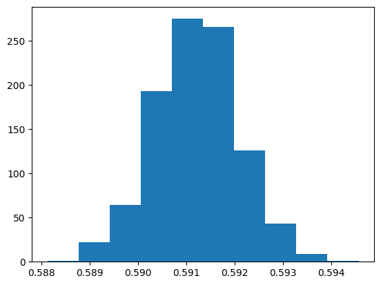

### Sampling distribution vs. bootstrap distribution

The sampling distribution and bootstrap distribution are closely linked.
In situations where you can repeatedly sample from a population (these
occasions are rare), it's helpful to generate both the sampling
distribution and the bootstrap distribution, one after the other, to see
how they are related.

Here, the statistic you are interested in is the mean `popularity` score
of the songs.

`spotify_population` (the whole dataset) and `spotify_sample` (`500`
randomly sampled rows from `spotify_population`) are available; `pandas`
and `numpy` are loaded with their usual aliases.

**Instructions**

- Generate a sampling distribution of 2000 replicates.
- Sample 500 rows of the population without replacement and calculate
  the mean `popularity`.

<!-- -->

- Generate a bootstrap distribution of 2000 replicates.
- Sample 500 rows of the sample with replacement and calculate the mean
  `popularity`.

**Answer**

```python
# added/edited
spotify_sample = spotify_population.sample(n=500)
```

```python
mean_popularity_2000_samp = []

# Generate a sampling distribution of 2000 replicates
for i in range(2000):
    mean_popularity_2000_samp.append(
     # Sample 500 rows and calculate the mean popularity     
     spotify_population.sample(n=500)['popularity'].mean()
    )

# Print the sampling distribution results
print(mean_popularity_2000_samp)


mean_popularity_2000_boot = []

# Generate a bootstrap distribution of 2000 replicates
for i in range(2000):
    mean_popularity_2000_boot.append(
     # Resample 500 rows and calculate the mean popularity
     spotify_sample.sample(n=500, replace=True)['popularity'].mean()
    )

# Print the bootstrap distribution results
print(mean_popularity_2000_boot)

```

    [54.626, 55.044, 54.21, 55.29, 53.746, 55.494, 54.74, 54.696, 54.252, 54.456, 54.006, 55.086, 53.806, 54.532, 54.188, 55.182, 54.662, 53.794, 55.152, 55.0, 54.288, 54.896, 54.342, 54.436, 54.844, 53.85, 55.034, 54.72, 55.054, 54.812, 53.89, 55.006, 54.798, 54.638, 54.484, 54.836, 54.142, 54.502, 54.204, 55.26, 54.754, 54.55, 55.04, 55.054, 55.12, 54.582, 54.056, 53.994, 55.342, 55.094, 54.112, 55.394, 54.846, 55.022, 54.958, 54.688, 54.534, 55.148, 55.102, 54.676, 55.17, 54.9, 53.328, 55.102, 55.166, 55.354, 54.6, 54.95, 55.11, 55.556, 53.756, 55.38, 55.87, 54.998, 55.48, 54.802, 54.2, 55.49, 55.048, 54.702, 54.446, 54.834, 54.196, 55.13, 54.49, 54.668, 54.226, 54.504, 55.024, 55.462, 54.762, 54.464, 54.63, 54.348, 55.854, 53.966, 55.458, 54.832, 54.868, 55.218, 54.352, 55.716, 54.582, 54.698, 54.266, 53.88, 54.286, 55.928, 54.91, 55.114, 55.042, 55.14, 55.378, 54.354, 54.702, 53.91, 54.454, 56.08, 55.316, 55.262, 55.37, 54.37, 56.048, 54.596, 54.53, 55.094, 54.328, 54.854, 55.178, 55.24, 55.386, 54.834, 54.398, 54.734, 54.73, 54.67, 54.508, 55.362, 55.138, 54.628, 54.224, 55.354, 53.914, 54.832, 54.42, 54.356, 54.508, 54.916, 55.66, 55.274, 54.744, 53.412, 55.218, 55.414, 54.914, 54.404, 54.484, 54.654, 54.868, 53.746, 55.172, 54.716, 55.302, 54.814, 53.93, 54.366, 54.976, 55.05, 54.296, 54.64, 55.446, 55.378, 54.81, 55.194, 54.284, 55.236, 54.594, 55.018, 54.534, 55.362, 55.05, 54.932, 54.394, 55.14, 55.056, 54.594, 55.328, 54.786, 53.97, 54.526, 54.562, 54.678, 55.016, 54.058, 54.818, 54.76, 54.676, 54.85, 55.13, 54.88, 55.272, 55.444, 55.126, 54.854, 55.274, 55.162, 53.994, 54.74, 54.582, 55.59, 54.626, 54.174, 54.506, 55.016, 54.296, 54.526, 54.972, 54.966, 54.56, 55.194, 55.314, 54.914, 54.64, 54.156, 55.53, 54.35, 55.436, 54.206, 54.834, 54.316, 54.186, 55.414, 54.698, 55.182, 54.996, 54.596, 55.146, 55.05, 54.142, 55.868, 54.39, 55.002, 54.688, 54.986, 54.766, 54.804, 55.602, 54.37, 55.11, 54.422, 54.946, 54.228, 54.018, 54.376, 55.372, 54.792, 54.91, 54.568, 54.828, 55.176, 54.53, 54.974, 54.966, 54.904, 55.05, 55.19, 55.436, 55.634, 55.278, 54.806, 55.098, 55.158, 54.834, 54.606, 54.942, 54.71, 55.744, 54.806, 54.102, 54.37, 55.07, 54.74, 54.05, 54.838, 54.27, 55.038, 54.574, 54.71, 54.936, 53.938, 55.57, 54.924, 55.332, 54.506, 55.212, 55.286, 54.908, 54.86, 54.392, 54.782, 54.674, 54.584, 54.894, 54.136, 55.704, 54.522, 56.19, 55.122, 54.504, 54.726, 54.068, 54.508, 55.15, 55.186, 54.22, 54.488, 54.908, 54.002, 54.778, 54.87, 54.75, 54.694, 54.008, 55.176, 55.128, 55.552, 55.106, 54.538, 55.196, 55.25, 55.006, 55.062, 55.048, 54.686, 54.922, 55.38, 53.854, 54.94, 54.956, 55.602, 54.84, 54.928, 54.578, 54.51, 54.522, 55.236, 54.866, 55.472, 55.004, 55.508, 55.038, 54.684, 55.29, 54.876, 54.86, 55.306, 54.788, 54.374, 54.538, 54.276, 54.852, 54.644, 54.848, 55.184, 54.876, 54.674, 54.2, 54.272, 53.948, 55.56, 54.81, 55.008, 54.824, 54.44, 54.802, 54.966, 53.956, 55.006, 55.062, 54.646, 54.93, 55.12, 54.568, 55.256, 54.812, 54.804, 54.828, 54.982, 54.25, 54.786, 54.54, 54.664, 54.368, 55.216, 54.332, 55.148, 54.99, 55.34, 54.108, 55.3, 54.514, 54.442, 54.472, 55.572, 54.728, 54.32, 54.622, 55.196, 55.088, 55.368, 54.762, 54.586, 53.338, 54.444, 54.506, 55.006, 54.684, 54.766, 54.54, 54.526, 54.838, 55.02, 54.642, 54.894, 55.246, 54.466, 55.376, 55.324, 54.182, 55.344, 54.608, 54.834, 54.606, 55.15, 54.896, 55.29, 54.424, 54.528, 55.578, 55.046, 55.574, 55.052, 55.468, 54.574, 54.266, 55.404, 55.532, 55.294, 55.414, 55.648, 54.348, 55.294, 55.622, 54.836, 54.676, 54.18, 55.072, 54.832, 54.902, 55.122, 53.898, 55.164, 55.254, 54.704, 54.452, 54.482, 55.554, 54.492, 55.582, 55.284, 55.09, 55.568, 54.374, 55.126, 55.1, 53.886, 54.602, 54.352, 55.814, 54.672, 54.98, 54.772, 54.944, 54.398, 54.788, 55.144, 55.146, 55.768, 54.96, 55.054, 55.05, 54.386, 54.494, 54.198, 54.08, 55.25, 54.512, 55.222, 54.942, 53.65, 54.266, 54.28, 54.512, 55.056, 55.096, 54.386, 54.87, 55.144, 54.778, 55.15, 55.02, 55.198, 54.522, 55.526, 54.86, 55.698, 54.672, 54.778, 55.082, 54.54, 55.278, 54.608, 54.732, 54.5, 55.364, 55.754, 55.934, 54.872, 55.494, 54.762, 55.054, 54.904, 55.102, 55.244, 54.084, 54.384, 55.414, 53.896, 55.016, 54.666, 53.904, 54.964, 54.966, 55.046, 55.494, 54.026, 54.56, 54.564, 54.926, 55.256, 53.998, 55.278, 53.922, 54.994, 54.806, 54.56, 55.118, 54.798, 55.2, 54.262, 55.088, 53.788, 54.226, 54.448, 54.792, 53.99, 55.332, 55.426, 54.638, 54.006, 54.914, 53.912, 54.832, 54.026, 55.186, 55.272, 54.642, 54.148, 54.966, 54.122, 55.522, 54.64, 55.362, 55.33, 54.578, 55.324, 54.658, 55.238, 54.874, 54.976, 53.942, 55.306, 54.392, 54.722, 55.284, 54.406, 54.778, 54.59, 54.998, 54.742, 55.778, 55.652, 55.176, 54.272, 53.91, 55.276, 54.83, 54.376, 55.264, 55.418, 53.866, 54.992, 54.186, 54.918, 55.02, 54.462, 55.512, 54.938, 54.702, 54.838, 55.152, 55.196, 55.386, 55.086, 54.96, 55.45, 55.428, 54.098, 55.076, 55.258, 54.806, 54.776, 55.082, 55.374, 55.554, 54.974, 55.16, 54.812, 54.792, 54.8, 54.892, 55.118, 54.584, 54.818, 53.736, 54.118, 54.922, 54.662, 55.218, 55.474, 55.116, 55.09, 55.138, 56.236, 54.396, 54.3, 54.784, 54.536, 54.726, 55.428, 54.966, 55.02, 55.238, 55.658, 54.904, 55.454, 55.436, 54.228, 54.624, 55.018, 55.398, 54.328, 55.132, 53.66, 55.132, 54.456, 55.342, 55.034, 55.49, 54.506, 54.818, 55.524, 55.356, 56.044, 55.166, 54.934, 55.03, 54.99, 54.702, 54.57, 54.636, 55.292, 53.392, 54.904, 54.664, 54.942, 55.552, 54.238, 54.898, 54.736, 55.158, 54.85, 55.076, 54.724, 54.836, 54.992, 54.002, 55.07, 54.902, 55.33, 54.764, 54.748, 54.34, 55.33, 54.282, 54.172, 54.45, 54.372, 54.374, 54.588, 55.612, 54.398, 54.182, 55.004, 54.802, 54.728, 54.566, 54.216, 55.08, 54.564, 54.198, 54.292, 55.366, 54.972, 54.806, 54.346, 54.934, 54.41, 53.28, 54.432, 54.418, 54.84, 55.226, 54.808, 55.308, 55.932, 54.572, 55.53, 54.992, 54.46, 54.754, 55.718, 54.082, 54.868, 54.076, 54.348, 55.794, 55.08, 53.53, 54.692, 54.928, 53.994, 54.458, 55.002, 54.984, 55.4, 53.856, 54.85, 55.056, 54.992, 54.484, 54.826, 54.66, 54.68, 54.908, 54.706, 55.38, 54.61, 54.542, 55.118, 54.886, 54.912, 54.544, 54.49, 54.756, 55.09, 54.428, 54.756, 55.61, 54.67, 55.282, 55.344, 54.06, 55.312, 55.322, 54.102, 54.67, 55.072, 54.412, 55.024, 56.164, 54.62, 55.826, 54.2, 55.534, 54.688, 55.0, 54.798, 54.58, 55.076, 55.154, 54.676, 54.724, 54.152, 54.542, 55.56, 55.164, 55.188, 55.89, 54.68, 54.824, 55.57, 55.166, 54.158, 54.924, 55.168, 54.582, 55.1, 55.018, 54.174, 55.632, 54.97, 56.006, 55.02, 54.336, 55.718, 55.194, 54.314, 54.816, 54.574, 54.404, 54.618, 55.294, 54.51, 54.82, 54.936, 54.15, 54.882, 54.136, 54.334, 54.886, 54.102, 54.692, 54.714, 54.848, 54.264, 55.526, 55.344, 54.606, 55.272, 55.02, 54.096, 54.408, 54.508, 54.958, 54.784, 54.776, 54.586, 55.698, 54.426, 55.028, 54.916, 54.5, 55.096, 54.404, 54.806, 54.82, 54.494, 55.006, 54.636, 54.994, 54.61, 55.288, 54.942, 54.388, 54.948, 54.252, 54.498, 54.342, 55.194, 54.408, 54.672, 54.126, 54.964, 54.136, 55.32, 54.478, 55.622, 54.894, 55.018, 53.632, 55.904, 54.804, 54.53, 54.394, 54.726, 55.712, 55.296, 54.266, 55.518, 54.92, 53.406, 55.014, 53.546, 54.664, 55.278, 54.686, 54.616, 55.02, 54.886, 55.936, 55.108, 55.232, 55.406, 55.162, 55.33, 55.132, 54.076, 54.054, 54.72, 54.116, 55.404, 54.25, 54.836, 54.29, 54.986, 55.068, 55.034, 54.972, 54.608, 54.476, 54.448, 54.832, 55.466, 54.17, 54.554, 54.032, 54.56, 54.324, 55.3, 54.45, 55.172, 54.488, 55.64, 54.908, 54.908, 54.952, 55.016, 55.108, 54.952, 54.502, 55.162, 54.752, 54.144, 55.532, 54.81, 55.116, 55.424, 55.228, 55.076, 55.512, 55.032, 56.24, 55.12, 55.346, 54.808, 54.608, 55.144, 54.362, 55.1, 54.42, 55.104, 55.13, 55.484, 53.502, 55.032, 54.782, 54.458, 53.862, 54.282, 54.914, 55.108, 55.042, 54.846, 55.002, 54.57, 54.26, 54.8, 55.942, 54.856, 55.27, 55.456, 55.076, 54.67, 54.646, 54.656, 55.436, 55.91, 55.454, 55.352, 54.71, 55.048, 55.132, 54.766, 54.016, 54.486, 54.648, 55.462, 55.158, 54.748, 55.082, 54.274, 54.322, 55.124, 54.432, 55.226, 55.256, 54.352, 54.492, 54.97, 54.998, 54.118, 53.636, 54.184, 55.31, 55.168, 54.764, 53.658, 55.362, 54.634, 55.468, 55.14, 54.292, 54.354, 54.406, 54.038, 54.278, 54.538, 53.898, 54.722, 55.266, 54.646, 54.702, 54.396, 55.098, 54.574, 54.604, 55.612, 55.264, 55.216, 55.262, 54.158, 55.016, 54.424, 55.368, 55.234, 55.674, 54.67, 54.794, 54.48, 55.09, 55.38, 55.404, 54.462, 54.524, 55.414, 54.806, 54.888, 54.722, 54.468, 55.104, 53.976, 54.656, 54.372, 54.848, 54.534, 55.368, 55.266, 55.246, 54.48, 54.77, 54.514, 54.546, 54.562, 55.22, 54.768, 54.78, 54.216, 54.148, 55.77, 54.658, 54.778, 54.022, 55.09, 54.748, 54.428, 54.566, 55.314, 54.72, 54.09, 55.02, 54.62, 55.856, 54.102, 54.788, 55.384, 54.748, 54.84, 54.776, 54.6, 55.374, 55.442, 54.496, 54.128, 54.698, 55.268, 55.324, 53.984, 54.954, 55.77, 54.374, 54.188, 54.572, 54.648, 54.4, 54.138, 54.27, 55.5, 56.068, 54.21, 55.134, 55.702, 55.09, 55.166, 54.766, 54.634, 53.78, 55.062, 55.09, 55.072, 55.018, 54.332, 55.308, 54.656, 55.166, 55.09, 55.164, 55.17, 54.336, 55.02, 55.068, 54.512, 54.698, 54.524, 54.884, 55.446, 55.284, 54.308, 55.008, 53.814, 54.56, 55.094, 55.302, 54.292, 55.19, 54.822, 55.496, 54.474, 54.122, 55.73, 54.296, 55.258, 54.928, 54.932, 54.326, 54.958, 55.36, 54.14, 55.01, 54.94, 55.044, 54.678, 55.37, 54.964, 54.516, 54.97, 55.076, 55.4, 54.43, 53.828, 54.32, 55.358, 55.686, 54.688, 53.794, 54.832, 55.226, 55.264, 54.828, 54.506, 53.614, 54.926, 54.972, 55.174, 54.748, 54.476, 54.576, 54.406, 54.91, 55.334, 54.478, 54.844, 54.254, 55.286, 55.368, 54.532, 55.904, 55.614, 55.398, 54.888, 54.788, 55.236, 55.172, 54.278, 54.568, 55.372, 54.346, 54.412, 54.364, 54.426, 54.84, 54.486, 54.49, 54.856, 55.022, 55.442, 55.112, 54.968, 55.64, 55.122, 55.116, 55.64, 55.204, 54.564, 54.272, 54.69, 54.646, 55.492, 54.42, 54.848, 54.95, 54.67, 54.104, 54.102, 54.432, 55.146, 55.312, 54.892, 54.592, 54.81, 53.8, 54.206, 54.876, 55.08, 55.316, 55.734, 54.354, 54.79, 54.858, 55.47, 54.26, 54.772, 55.4, 55.168, 54.78, 55.068, 54.858, 55.194, 55.056, 54.428, 54.206, 53.7, 54.758, 55.84, 54.608, 55.118, 54.35, 55.008, 56.032, 55.23, 54.486, 55.156, 54.814, 53.988, 54.458, 55.394, 54.616, 54.98, 55.326, 54.208, 54.5, 54.888, 54.608, 55.152, 54.354, 54.702, 54.626, 54.696, 54.612, 54.918, 54.456, 55.682, 54.876, 54.968, 54.502, 55.526, 55.584, 53.756, 54.302, 55.314, 54.7, 53.948, 54.948, 54.946, 55.252, 54.136, 54.266, 54.92, 54.326, 54.71, 54.714, 54.994, 54.476, 54.294, 55.658, 54.846, 55.312, 54.692, 53.84, 54.542, 55.158, 54.238, 54.374, 54.528, 55.188, 54.678, 55.154, 55.636, 55.19, 55.172, 55.308, 54.632, 55.334, 54.962, 54.402, 55.91, 54.924, 55.076, 54.202, 54.014, 54.406, 54.636, 54.364, 55.17, 54.504, 54.318, 54.23, 54.332, 54.548, 53.97, 55.472, 54.842, 54.818, 54.2, 54.848, 55.08, 54.692, 54.4, 54.926, 54.442, 54.924, 54.504, 55.424, 54.922, 54.748, 55.142, 54.63, 54.866, 54.992, 54.756, 55.324, 54.114, 55.14, 54.744, 54.308, 55.448, 54.998, 55.134, 55.53, 55.094, 54.71, 54.56, 55.442, 54.65, 54.998, 55.214, 54.578, 53.454, 53.866, 55.04, 54.176, 54.802, 54.88, 54.448, 54.65, 55.196, 54.88, 55.29, 54.216, 55.178, 55.688, 55.422, 55.188, 55.122, 54.288, 54.296, 54.862, 55.344, 54.296, 55.154, 54.438, 54.94, 54.632, 55.11, 55.478, 54.93, 55.216, 54.334, 54.358, 53.932, 55.604, 54.878, 54.386, 54.636, 55.648, 54.54, 55.04, 54.51, 54.74, 54.912, 55.686, 54.308, 55.032, 54.684, 53.958, 54.992, 54.806, 54.724, 54.746, 54.764, 54.762, 55.29, 53.944, 54.912, 54.534, 54.718, 55.816, 54.594, 54.86, 53.948, 54.736, 54.7, 55.542, 55.574, 55.174, 54.172, 54.566, 54.406, 55.366, 55.732, 54.264, 55.344, 54.994, 55.05, 55.124, 54.914, 54.492, 55.076, 55.48, 54.254, 54.066, 54.568, 54.808, 54.256, 54.932, 55.566, 54.772, 54.632, 54.26, 55.05, 54.562, 54.616, 55.352, 53.862, 54.84, 54.554, 54.16, 54.944, 54.978, 54.564, 55.094, 54.202, 54.974, 54.952, 55.224, 55.058, 54.912, 55.106, 55.47, 55.258, 54.402, 54.158, 54.15, 54.938, 55.086, 55.384, 54.514, 54.572, 54.534, 54.18, 55.062, 54.66, 54.302, 53.926, 54.544, 54.534, 54.658, 55.434, 54.506, 54.38, 54.658, 54.946, 55.78, 55.298, 54.394, 54.578, 54.536, 55.944, 55.32, 54.33, 54.656, 55.104, 54.752, 54.472, 54.556, 54.562, 54.246, 54.602, 53.878, 55.53, 54.488, 54.468, 54.476, 54.376, 54.552, 55.794, 55.58, 54.376, 55.266, 55.182, 54.268, 54.284, 54.504, 54.82, 54.628, 54.928, 54.822, 55.03, 54.53, 54.882, 54.656, 54.396, 54.444, 54.248, 55.472, 54.31, 55.956, 54.65, 54.204, 54.216, 55.292, 54.324, 55.234, 55.13, 54.55, 54.516, 54.188, 54.732, 55.172, 53.74, 54.766, 55.326, 54.418, 55.01, 54.134, 54.812, 55.01, 54.856, 54.8, 54.622, 54.288, 54.22, 55.254, 54.06, 55.376, 55.216, 55.166, 55.48, 55.164, 54.208, 55.032, 54.1, 54.946, 55.284, 55.484, 54.618, 55.176, 54.31, 54.458, 54.514, 56.184, 54.23, 54.788, 55.202, 54.922, 54.652, 55.53, 55.4, 55.336, 54.826, 53.912, 54.874, 55.224, 54.966, 54.67, 54.634, 55.09, 55.024, 55.332, 55.588, 54.464, 55.1, 55.128, 54.358, 54.524, 54.972, 54.48, 53.572, 55.04, 55.594, 54.564, 54.846, 55.084, 55.052, 54.652, 55.134, 54.39, 54.642, 54.204, 54.654, 55.068, 54.764, 54.768, 55.498, 54.824, 54.292, 54.17, 54.76, 54.744, 54.224, 55.052, 55.046, 55.118, 54.884, 55.15, 55.42, 54.424, 54.6, 54.59, 54.756, 55.794, 54.666, 55.74, 54.448, 54.696, 54.612, 54.102, 55.276, 54.234, 53.482, 55.086, 55.568, 55.51, 55.078, 55.008, 54.992, 54.31, 53.758, 55.368, 55.452, 55.43, 54.63, 54.836, 54.116, 53.952, 55.144, 55.022, 55.024, 54.852, 54.458, 55.042, 54.682, 54.208, 54.614, 54.886, 55.308, 55.022, 55.52, 55.318, 54.974, 54.67, 54.728, 55.194, 54.046, 54.532, 55.334, 55.274, 55.138, 54.726, 54.794, 54.588, 54.988, 54.938, 54.956, 55.408, 54.748, 55.456, 54.8, 54.758, 55.222, 54.694, 54.512, 54.522, 55.292, 54.752, 54.256, 54.256, 55.336, 54.92, 55.076, 54.366, 55.646, 55.222, 54.666, 54.406, 54.94, 55.168, 54.718, 53.932, 54.684, 54.684, 54.944, 54.456, 55.204, 54.6, 55.612, 55.348, 55.204, 55.06, 55.456, 55.056, 54.582, 54.62, 54.822, 54.718, 55.026, 54.592, 55.376, 54.664, 55.112, 54.456, 55.328, 54.25, 55.53, 54.248, 53.998, 54.352, 54.746, 55.114, 55.184, 54.56, 55.26, 55.742, 55.77, 54.984, 54.55, 55.338, 54.774, 54.64, 55.366, 54.578, 54.556, 54.068, 54.344, 55.42, 54.256, 54.818, 54.218, 53.896, 55.316, 54.112, 54.824, 53.96, 54.532, 54.348, 54.692, 54.888, 54.708, 54.75, 55.19, 55.05, 54.02, 53.454, 54.652, 54.236, 54.776, 54.164, 54.656, 54.268, 54.668, 55.066, 54.582, 55.07, 54.628, 54.512, 55.508, 54.494, 54.808, 55.178, 54.578, 55.036, 55.404, 54.568, 54.072, 55.492, 54.704, 53.828, 54.272, 54.988, 54.314, 54.77, 54.73, 54.762, 54.262, 54.962, 54.47, 53.942, 54.032, 54.206, 54.772, 55.626, 55.124, 54.8, 54.954, 55.918, 55.308, 54.774, 54.876, 54.43, 54.84, 54.774, 54.676, 54.512, 54.424, 53.504, 54.128, 54.764, 53.968, 54.658, 54.62, 54.964, 54.968, 55.386, 55.056, 54.75, 54.67, 55.31, 55.218, 54.412, 54.14, 55.03, 55.418, 55.03, 54.638, 54.856, 55.256, 55.134, 54.8, 54.822, 54.83, 55.076, 55.394, 54.462, 54.568, 55.062, 55.156, 54.42, 55.662, 55.898, 54.104, 54.72, 54.462, 55.052, 54.634, 55.794, 55.314, 54.642, 54.492, 53.924, 54.974, 54.998, 55.438, 55.03, 54.69, 56.058, 54.68, 55.278, 55.044, 55.094, 54.848, 54.552, 55.318, 55.142, 54.87, 54.518, 54.944, 54.418, 55.032, 54.394, 54.966, 56.086, 54.9, 55.176, 55.036, 54.448, 54.68, 54.048, 54.79, 53.532, 55.08, 54.734, 54.208, 54.566, 55.21, 54.468, 55.046, 53.594, 54.476, 54.856, 54.312, 55.012, 55.4, 54.978, 54.55, 54.418, 54.36, 54.99, 54.516, 55.368, 54.034, 54.96, 54.888, 55.122, 55.51, 54.614, 54.838, 55.184, 54.526, 54.868, 54.744]
    [55.334, 54.016, 54.922, 54.828, 54.22, 54.956, 54.462, 54.648, 54.802, 54.346, 55.306, 54.686, 53.932, 55.546, 55.056, 54.598, 54.084, 55.308, 55.362, 55.26, 54.122, 53.75, 54.862, 55.548, 54.714, 54.376, 54.3, 54.944, 54.726, 54.448, 54.6, 54.776, 53.822, 54.282, 55.236, 54.944, 54.96, 54.322, 53.832, 54.862, 53.84, 55.94, 54.718, 55.166, 54.898, 55.214, 54.56, 55.1, 54.258, 54.49, 54.822, 55.748, 54.712, 54.83, 55.268, 54.308, 54.868, 54.664, 53.84, 54.876, 54.826, 54.726, 54.696, 55.048, 53.982, 54.77, 55.042, 54.672, 53.85, 56.19, 54.912, 54.312, 54.72, 54.344, 55.206, 54.476, 54.558, 54.612, 54.51, 54.87, 54.466, 54.432, 55.044, 54.404, 54.784, 54.608, 55.232, 54.684, 54.998, 54.79, 55.17, 55.18, 54.222, 54.51, 55.064, 54.318, 54.94, 54.742, 55.136, 55.018, 55.024, 55.172, 53.98, 54.108, 55.054, 54.576, 54.96, 54.556, 55.208, 54.308, 55.736, 55.008, 55.042, 54.814, 54.578, 54.834, 55.25, 54.968, 54.79, 54.568, 54.964, 55.082, 54.482, 54.984, 54.918, 54.282, 54.094, 54.04, 54.756, 54.852, 54.472, 54.514, 54.422, 54.546, 55.006, 54.38, 54.736, 54.99, 55.688, 54.634, 55.618, 55.14, 54.976, 54.572, 55.01, 54.922, 55.116, 54.056, 55.31, 54.026, 54.512, 54.888, 55.466, 54.326, 54.006, 55.258, 55.39, 54.586, 54.858, 54.04, 54.448, 55.156, 55.638, 54.322, 55.66, 55.02, 54.092, 54.826, 55.348, 55.29, 54.76, 54.426, 55.29, 54.982, 54.314, 54.594, 54.54, 54.452, 54.658, 54.52, 54.662, 55.428, 54.034, 55.402, 54.092, 54.23, 53.956, 55.49, 54.878, 55.926, 54.56, 54.568, 55.23, 55.29, 54.976, 54.576, 54.32, 55.866, 54.966, 54.868, 54.59, 55.458, 55.06, 54.074, 54.16, 54.816, 54.268, 54.622, 54.634, 53.854, 54.976, 54.2, 55.168, 54.882, 53.834, 54.968, 55.058, 54.424, 54.456, 54.39, 55.014, 54.536, 53.802, 54.57, 54.188, 54.742, 54.86, 54.968, 54.448, 55.33, 54.312, 54.388, 55.158, 54.312, 54.116, 54.682, 54.594, 54.724, 55.076, 55.458, 55.326, 54.714, 54.898, 54.41, 54.228, 54.7, 55.046, 55.178, 54.11, 54.756, 54.374, 54.286, 55.292, 54.604, 54.232, 54.764, 55.216, 54.588, 54.75, 54.42, 55.106, 55.326, 55.046, 54.468, 54.6, 54.628, 53.654, 55.202, 53.328, 55.662, 54.25, 55.22, 55.228, 54.87, 55.856, 54.672, 55.382, 54.32, 54.678, 54.912, 54.216, 54.538, 54.376, 54.974, 53.76, 54.894, 54.772, 54.34, 54.872, 54.864, 54.332, 54.036, 54.626, 54.93, 55.082, 54.776, 54.292, 53.876, 54.748, 55.032, 54.196, 55.182, 54.67, 54.738, 54.068, 54.528, 55.118, 54.836, 54.828, 54.996, 54.604, 54.894, 54.528, 54.732, 55.232, 54.598, 54.852, 54.802, 54.572, 54.698, 54.532, 55.028, 54.504, 54.912, 54.534, 54.296, 54.484, 55.022, 55.198, 54.72, 54.358, 54.608, 54.254, 54.904, 54.764, 53.918, 55.146, 54.838, 54.9, 54.982, 55.132, 54.868, 54.592, 54.672, 54.72, 54.906, 54.474, 54.73, 55.38, 55.64, 55.428, 54.832, 54.68, 54.716, 54.714, 54.538, 54.352, 54.486, 55.066, 53.74, 55.246, 54.568, 54.24, 54.716, 54.714, 55.324, 55.092, 54.416, 55.074, 54.586, 54.038, 54.826, 54.844, 54.79, 54.304, 55.232, 54.586, 54.936, 54.538, 54.606, 55.072, 55.286, 54.612, 54.49, 54.308, 54.492, 54.62, 55.054, 54.728, 54.438, 54.546, 54.098, 54.004, 54.378, 55.148, 54.226, 54.84, 55.04, 55.392, 54.532, 54.988, 54.712, 54.49, 54.972, 54.326, 55.002, 54.01, 54.734, 55.12, 54.466, 54.48, 54.648, 55.2, 55.03, 55.592, 53.954, 54.58, 55.218, 55.506, 55.028, 54.474, 54.856, 55.296, 54.404, 53.606, 54.904, 53.964, 54.502, 54.104, 55.102, 54.324, 54.334, 55.016, 54.852, 54.592, 54.84, 53.944, 55.528, 54.18, 54.446, 54.354, 54.606, 54.798, 54.394, 54.52, 53.984, 54.926, 54.908, 54.858, 54.058, 55.156, 54.81, 54.698, 54.608, 54.332, 54.874, 54.388, 55.226, 54.558, 54.866, 54.608, 55.618, 55.054, 54.188, 55.364, 54.804, 54.702, 54.558, 54.692, 54.082, 54.336, 54.798, 55.32, 54.582, 54.338, 55.126, 54.84, 54.912, 54.82, 54.21, 54.36, 54.67, 54.98, 54.202, 54.774, 54.664, 54.638, 55.108, 55.064, 54.554, 54.23, 54.276, 54.726, 55.176, 55.082, 54.414, 54.412, 55.466, 55.58, 54.838, 54.868, 54.464, 55.214, 54.974, 55.006, 54.948, 55.15, 54.694, 55.324, 54.894, 54.554, 54.072, 54.402, 55.024, 54.186, 53.95, 54.932, 54.422, 54.614, 55.368, 54.952, 54.348, 54.828, 54.488, 54.634, 54.916, 54.692, 54.826, 54.532, 54.698, 55.15, 55.46, 54.894, 54.962, 54.56, 54.994, 55.174, 55.328, 55.36, 53.84, 54.964, 54.94, 55.816, 55.096, 55.05, 55.528, 55.236, 54.482, 54.276, 55.822, 54.926, 54.96, 55.324, 54.572, 54.192, 53.848, 54.284, 54.462, 54.608, 55.012, 53.97, 54.364, 54.872, 54.696, 54.308, 55.632, 54.264, 54.678, 55.352, 54.522, 54.338, 54.704, 54.976, 54.162, 55.14, 55.08, 55.192, 55.508, 54.424, 54.532, 54.522, 54.406, 54.694, 54.638, 53.776, 53.798, 54.824, 54.264, 54.67, 54.836, 54.362, 54.32, 55.114, 54.532, 54.746, 54.452, 55.494, 54.484, 54.484, 54.172, 54.88, 54.236, 54.526, 54.542, 54.908, 55.344, 54.68, 54.808, 54.86, 54.992, 54.008, 55.448, 54.662, 54.878, 55.058, 54.082, 54.4, 54.302, 54.084, 55.076, 54.62, 54.58, 55.438, 54.714, 54.508, 54.746, 54.002, 54.63, 54.08, 54.19, 56.178, 55.054, 54.776, 54.144, 54.7, 54.256, 54.71, 54.672, 54.186, 54.716, 55.014, 55.206, 55.512, 54.37, 54.516, 54.334, 54.426, 55.372, 54.63, 54.114, 53.778, 55.274, 54.96, 54.568, 54.314, 54.45, 55.188, 54.546, 54.756, 55.038, 54.416, 55.21, 54.86, 54.498, 55.236, 54.594, 53.952, 55.082, 54.922, 54.688, 55.282, 54.796, 54.776, 53.994, 55.596, 55.126, 54.544, 55.41, 55.198, 55.11, 54.672, 54.65, 53.848, 54.852, 54.794, 54.744, 54.73, 53.658, 54.88, 54.24, 54.3, 54.002, 55.064, 55.39, 54.34, 54.928, 54.294, 54.8, 54.898, 54.68, 54.54, 54.554, 54.002, 54.35, 54.648, 54.2, 54.458, 55.092, 55.21, 55.01, 54.914, 54.31, 54.246, 54.654, 55.586, 53.78, 55.17, 54.942, 55.78, 54.706, 54.742, 54.914, 54.63, 54.8, 55.368, 54.324, 54.966, 55.088, 54.794, 54.942, 55.452, 54.554, 55.06, 55.162, 54.106, 54.642, 54.474, 54.098, 54.944, 54.694, 54.068, 54.206, 55.216, 54.548, 54.796, 54.83, 55.034, 55.296, 55.806, 54.034, 55.366, 54.88, 54.624, 54.148, 54.308, 55.116, 54.508, 54.938, 55.308, 54.382, 54.98, 54.408, 54.47, 54.39, 54.732, 54.74, 55.364, 54.094, 54.062, 54.54, 55.278, 54.028, 54.85, 55.186, 53.896, 54.196, 54.814, 54.128, 54.07, 54.704, 55.074, 54.088, 54.596, 53.524, 55.072, 54.9, 55.874, 54.926, 54.762, 55.28, 55.18, 55.494, 55.132, 53.634, 55.086, 55.006, 55.398, 54.814, 54.334, 54.024, 54.794, 54.908, 54.346, 54.93, 54.182, 54.498, 54.576, 54.268, 55.22, 54.894, 54.558, 54.306, 54.498, 54.976, 54.126, 54.468, 54.582, 54.612, 55.034, 54.874, 54.49, 54.152, 55.154, 55.08, 54.44, 54.526, 54.054, 54.998, 56.216, 54.864, 55.174, 55.494, 54.702, 53.742, 54.508, 53.866, 54.844, 54.766, 54.502, 54.768, 54.156, 55.076, 54.95, 54.478, 54.158, 55.208, 55.148, 54.658, 54.654, 55.262, 54.924, 54.396, 54.262, 54.592, 54.886, 54.432, 54.482, 55.112, 54.752, 54.054, 54.374, 53.766, 54.362, 54.844, 54.406, 54.328, 54.864, 55.032, 54.582, 54.618, 54.932, 55.55, 55.406, 54.1, 55.424, 54.976, 54.018, 53.942, 54.054, 54.586, 54.652, 55.344, 54.394, 54.136, 54.698, 54.324, 54.738, 54.832, 54.372, 54.152, 54.224, 54.664, 54.216, 54.932, 54.794, 54.372, 55.016, 54.264, 54.982, 54.196, 55.132, 55.298, 55.046, 54.272, 54.346, 55.004, 54.168, 55.21, 53.758, 55.438, 54.41, 55.01, 55.168, 55.28, 54.604, 55.326, 54.69, 55.364, 54.588, 54.67, 54.528, 54.914, 55.688, 54.656, 55.054, 55.884, 55.438, 54.526, 54.564, 54.208, 54.354, 54.894, 53.872, 55.162, 55.036, 53.964, 53.772, 54.632, 54.86, 54.61, 54.512, 53.92, 54.644, 54.706, 55.002, 55.302, 54.754, 54.802, 54.914, 55.086, 54.466, 54.658, 54.796, 54.87, 54.816, 54.456, 54.76, 54.096, 55.008, 54.474, 54.968, 55.072, 55.166, 54.31, 54.738, 54.472, 55.194, 54.062, 54.918, 54.44, 55.354, 54.664, 55.226, 54.33, 55.156, 54.652, 54.652, 55.334, 54.604, 54.786, 54.256, 54.664, 54.308, 54.946, 54.91, 54.632, 54.44, 55.686, 54.608, 54.484, 55.068, 54.872, 54.576, 54.298, 54.158, 54.538, 54.042, 54.752, 54.412, 54.66, 53.588, 54.512, 54.922, 54.462, 54.622, 54.51, 54.354, 55.126, 54.314, 55.322, 54.514, 55.51, 53.974, 54.42, 54.504, 55.518, 54.824, 54.838, 54.754, 54.702, 54.562, 54.908, 54.576, 54.4, 54.942, 54.026, 53.934, 54.64, 54.642, 54.398, 54.622, 55.438, 54.966, 54.55, 54.884, 55.752, 54.694, 54.844, 54.842, 54.856, 55.35, 54.884, 53.584, 55.092, 55.336, 54.952, 55.838, 55.03, 54.948, 55.022, 54.068, 54.372, 54.584, 54.314, 54.346, 54.944, 55.646, 55.234, 55.076, 54.926, 55.05, 54.91, 54.754, 54.584, 55.1, 54.222, 54.296, 54.322, 54.77, 55.172, 54.924, 54.7, 55.258, 54.778, 54.0, 54.446, 55.28, 54.772, 55.144, 55.102, 54.622, 54.55, 55.072, 54.55, 54.452, 54.59, 55.036, 55.33, 53.744, 55.148, 54.78, 54.558, 55.07, 54.31, 53.97, 54.25, 54.394, 54.962, 54.29, 55.062, 54.268, 54.746, 54.752, 54.446, 55.324, 54.208, 54.854, 54.928, 54.744, 54.528, 54.948, 54.794, 54.432, 54.796, 54.424, 54.74, 55.292, 54.392, 55.228, 54.806, 55.466, 54.724, 54.574, 54.544, 54.924, 53.922, 55.26, 54.216, 54.504, 54.816, 54.574, 54.304, 54.652, 54.54, 54.578, 54.408, 54.982, 54.866, 55.158, 55.156, 54.438, 55.204, 54.668, 54.478, 54.224, 55.052, 54.358, 54.888, 54.754, 55.24, 54.874, 54.554, 54.782, 54.43, 53.914, 54.882, 54.75, 54.524, 55.158, 54.292, 54.66, 54.712, 54.952, 54.764, 54.522, 55.05, 55.166, 54.416, 54.676, 54.308, 54.754, 54.89, 54.906, 55.148, 54.618, 54.068, 54.702, 55.336, 54.914, 54.248, 54.734, 54.44, 54.852, 54.98, 54.636, 54.31, 54.298, 55.408, 54.71, 54.65, 54.112, 54.806, 54.08, 55.074, 55.042, 54.876, 54.376, 54.47, 54.574, 54.66, 54.822, 54.868, 55.136, 54.776, 54.97, 54.19, 54.122, 55.132, 54.392, 54.42, 54.654, 54.312, 54.786, 55.316, 54.708, 54.448, 55.108, 54.642, 54.374, 55.524, 54.964, 54.628, 55.048, 54.372, 54.142, 54.468, 54.538, 54.724, 54.472, 54.022, 55.632, 54.888, 54.632, 54.448, 53.816, 54.678, 55.024, 54.738, 55.64, 54.698, 54.904, 54.38, 54.554, 54.116, 54.146, 54.992, 54.472, 55.786, 55.436, 55.112, 55.112, 54.67, 54.388, 55.386, 54.582, 54.634, 54.768, 54.596, 54.102, 54.946, 54.788, 54.748, 55.048, 54.468, 55.434, 55.674, 54.992, 55.146, 55.208, 54.834, 55.236, 55.322, 54.934, 54.18, 54.58, 55.038, 54.978, 55.664, 54.138, 54.406, 54.71, 54.232, 53.854, 54.066, 54.756, 55.132, 54.234, 53.798, 54.45, 54.806, 55.162, 54.478, 54.77, 55.174, 54.446, 54.84, 55.454, 54.666, 54.884, 54.036, 54.284, 54.084, 54.938, 54.28, 55.042, 54.37, 54.156, 54.876, 54.432, 55.02, 54.85, 54.054, 54.786, 55.524, 55.564, 54.722, 54.544, 54.668, 54.842, 54.39, 54.434, 53.828, 54.276, 54.59, 54.548, 55.434, 53.966, 54.918, 55.512, 54.564, 54.182, 54.344, 55.508, 54.044, 55.498, 55.352, 53.906, 54.992, 54.692, 55.124, 54.228, 54.528, 54.872, 55.336, 55.084, 54.726, 54.658, 54.25, 54.868, 55.39, 55.224, 55.724, 55.168, 54.862, 55.156, 55.18, 54.206, 55.072, 54.566, 55.038, 54.414, 54.112, 54.422, 54.232, 54.84, 54.508, 54.204, 55.178, 55.036, 53.45, 55.01, 55.16, 55.036, 54.958, 54.054, 54.96, 55.038, 54.47, 54.602, 54.562, 55.058, 53.772, 54.846, 54.464, 54.186, 55.402, 55.116, 54.14, 54.84, 55.198, 54.688, 55.214, 54.41, 54.378, 54.34, 54.422, 54.248, 54.3, 55.338, 54.55, 54.382, 54.99, 54.294, 54.486, 55.024, 54.482, 54.682, 54.358, 54.66, 54.782, 54.914, 53.21, 54.034, 54.052, 54.268, 54.94, 54.604, 54.384, 54.716, 54.524, 53.946, 55.232, 55.192, 54.938, 54.872, 54.198, 54.544, 53.872, 54.546, 55.224, 55.664, 54.756, 54.622, 54.33, 54.452, 54.494, 54.974, 54.298, 54.802, 54.374, 54.134, 55.34, 55.476, 54.68, 54.292, 53.936, 54.702, 54.578, 55.404, 55.05, 54.728, 54.956, 54.938, 55.306, 54.888, 53.664, 55.524, 54.556, 54.68, 54.366, 54.998, 54.598, 54.602, 54.808, 53.712, 55.13, 54.558, 54.45, 54.11, 54.948, 54.396, 55.126, 54.672, 54.612, 54.34, 54.868, 54.882, 54.474, 55.192, 53.81, 54.93, 54.398, 54.29, 54.446, 54.398, 55.146, 54.842, 54.238, 54.054, 54.64, 55.068, 54.084, 54.292, 54.062, 54.902, 54.846, 55.748, 54.23, 54.354, 54.148, 54.23, 54.488, 54.826, 54.566, 55.034, 54.8, 55.152, 54.794, 54.862, 54.288, 54.832, 54.816, 54.096, 54.628, 54.996, 55.404, 54.238, 54.638, 54.502, 54.046, 55.11, 55.478, 54.688, 55.084, 54.648, 54.6, 54.444, 54.698, 54.4, 53.376, 54.372, 55.34, 55.272, 54.524, 54.814, 54.276, 55.122, 54.328, 54.112, 54.656, 55.194, 55.346, 54.722, 55.168, 54.508, 54.742, 54.622, 53.976, 54.62, 54.52, 55.01, 54.644, 54.326, 54.614, 54.716, 54.02, 54.032, 54.472, 54.472, 54.882, 54.494, 55.81, 54.34, 54.088, 54.754, 54.628, 54.986, 55.228, 54.348, 54.572, 54.648, 55.29, 54.724, 55.058, 55.002, 54.344, 54.636, 55.428, 54.782, 54.046, 55.024, 55.082, 53.868, 54.808, 55.268, 54.714, 54.17, 54.844, 55.012, 54.558, 54.964, 55.016, 55.372, 54.95, 54.388, 54.512, 55.166, 54.646, 54.596, 55.33, 54.522, 54.804, 54.232, 54.33, 55.304, 53.676, 54.836, 53.694, 55.244, 55.084, 54.396, 54.898, 54.79, 54.274, 54.718, 54.998, 55.034, 54.81, 54.482, 54.848, 55.274, 54.826, 54.68, 54.404, 54.418, 53.954, 55.402, 54.99, 55.32, 54.898, 54.94, 54.932, 54.58, 54.506, 55.468, 55.112, 55.28, 53.866, 54.69, 55.008, 53.948, 54.644, 54.5, 53.97, 55.06, 54.156, 54.252, 54.904, 54.516, 55.008, 54.682, 55.102, 55.176, 55.92, 54.54, 54.618, 54.704, 55.066, 54.822, 55.126, 54.57, 53.918, 54.682, 54.534, 55.128, 54.476, 54.396, 54.912, 55.344, 54.18, 55.202, 55.096, 54.158, 54.69, 55.038, 55.24, 54.454, 54.688, 54.382, 54.764, 54.268, 54.712, 54.542, 54.746, 55.396, 54.488, 54.536, 55.79, 54.926, 55.404, 55.092, 55.19, 55.222, 54.764, 54.678, 54.436, 54.568, 55.404, 54.322, 54.334, 55.03, 55.05, 54.72, 54.632, 55.36, 54.668, 54.916, 54.708, 54.298, 54.642, 54.816, 55.408, 54.286, 53.898, 54.964, 55.606, 54.724, 54.472, 55.184, 55.018, 54.978, 53.994, 54.538, 54.954, 54.92, 54.934, 54.362, 54.258, 55.334, 54.758, 54.608, 55.254, 54.268, 54.362, 54.684, 55.486, 55.628, 54.454, 54.68, 54.958, 54.374, 54.438, 54.712, 54.762, 54.906, 54.48, 54.418, 54.396, 55.674, 55.64, 55.566, 54.718, 54.892, 54.516, 54.602, 54.62, 54.614, 54.782, 54.272, 54.82, 53.978, 54.346, 54.466, 54.94, 54.8, 55.394, 54.026, 54.128, 54.596, 54.97, 54.922, 54.79, 55.134, 55.464, 54.33, 54.23, 55.026, 55.46, 54.68, 55.098, 54.342, 54.778, 54.388, 55.134, 54.558, 54.396, 54.208, 54.256, 54.76, 55.104, 54.78, 54.906, 55.272, 54.59, 55.136, 54.612, 55.128, 54.728, 55.228, 54.976, 54.742, 55.404, 54.46, 54.626, 54.974, 54.754, 54.596, 54.324, 54.574, 55.492, 54.368, 55.214, 54.334, 54.308, 54.366, 53.856, 55.31, 55.228, 54.618, 55.008, 54.688, 54.876, 55.4, 53.522, 54.69, 54.84, 54.612, 54.376, 55.184, 55.178, 54.318, 54.272, 53.954, 54.576, 53.948, 54.48, 54.742, 54.476, 54.728, 54.284, 54.164, 54.604, 54.39, 54.668, 53.732, 53.808, 54.506, 54.126, 54.766, 56.18, 55.36, 55.184, 54.786, 54.74, 54.444, 54.366, 54.5, 54.462, 54.286, 54.546, 54.47, 54.434, 54.212, 54.592, 54.712, 55.052, 55.014, 54.562, 54.612, 55.77, 54.506, 55.428, 55.126, 54.992, 54.316, 54.626, 54.584, 53.986, 54.514, 54.86, 54.976, 54.814, 55.232, 54.534, 54.628, 54.702, 54.572, 55.0, 54.722, 54.844, 54.942, 53.972, 55.296, 54.826, 54.742, 55.244, 54.322, 54.582, 54.794, 54.444, 55.214, 55.432, 54.718, 54.758, 54.416, 54.854, 55.126, 54.418, 54.372, 54.832, 55.256, 54.504, 54.88, 54.648, 54.054, 54.886, 54.13, 54.596, 54.272, 54.88, 54.14, 54.8, 54.83, 54.782, 54.936, 54.948, 55.1, 54.596, 53.628, 55.638, 54.83, 54.112, 54.538, 54.372, 54.874, 54.568, 54.974, 54.652, 55.318, 54.374, 54.262, 54.124, 56.004, 54.27, 54.622, 54.36, 54.476, 55.506, 54.492, 54.158, 55.218, 54.38, 55.356, 55.106, 53.78, 54.96, 55.21, 54.964, 54.672, 54.008, 55.078, 54.95, 55.236, 54.428, 55.182, 54.648, 54.35, 54.792, 55.138, 54.598, 55.772, 54.86, 55.046, 54.96, 55.35, 54.418, 54.672, 54.658, 55.028, 54.61, 54.266, 54.168, 54.008, 53.988, 55.012, 54.786, 54.966, 54.82, 54.944, 54.722, 54.85, 54.52, 54.656, 54.448, 54.104, 54.434, 54.94, 54.588, 54.442, 54.362]

### Compare sampling and bootstrap means

To make calculation easier, distributions similar to those calculated
from the previous exercise have been included, this time using a sample
size of `5000`.

`spotify_population`, `spotify_sample`, `sampling_distribution`, and
`bootstrap_distribution` are available; `pandas` and `numpy` are loaded
with their usual aliases.

**Instructions**

Calculate the mean `popularity` in 4 ways:

- Population: from `spotify_population`, take the mean of `popularity`.
- Sample: from `spotify_sample`, take the mean of `popularity`.
- Sampling distribution: from `sampling_distribution`, take its mean.
- Bootstrap distribution: from `bootstrap_distribution`, take its mean.

**Answer**

```python
# added/edited
sampling_distribution = [
    spotify_population.sample(n=500)['popularity'].mean()
    for _ in range(5000)
]
bootstrap_distribution = [
    spotify_sample.sample(n=500, replace=True)['popularity'].mean()
    for _ in range(5000)
]
```

```python
# Calculate the population mean popularity
pop_mean = spotify_population['popularity'].mean()

# Calculate the original sample mean popularity
samp_mean = spotify_sample['popularity'].mean()

# Calculate the sampling dist'n estimate of mean popularity
samp_distn_mean = np.mean(sampling_distribution)

# Calculate the bootstrap dist'n estimate of mean popularity
boot_distn_mean = np.mean(bootstrap_distribution)

# Print the means
print([pop_mean, samp_mean, samp_distn_mean, boot_distn_mean])
```

    [54.837142308430955, 54.692, 54.833814399999994, 54.684377200000014]

### Compare sampling and bootstrap standard deviations

In the same way that you looked at how the sampling distribution and
bootstrap distribution could be used to estimate the population mean,
you'll now take a look at how they can be used to estimate variation, or
more specifically, the standard deviation, in the population.

Recall that the sample size is `5000`.

`spotify_population`, `spotify_sample`, `sampling_distribution`, and
`bootstrap_distribution` are available; `pandas` and `numpy` are loaded
with their usual aliases.

**Instructions**

Calculate the standard deviation of `popularity` in 4 ways.

- Population: from `spotify_population`, take the standard deviation of
  `popularity`.
- Original sample: from `spotify_sample`, take the standard deviation of
  `popularity`.
- Sampling distribution: from `sampling_distribution`, take its standard
  deviation and multiply by the square root of the sample size (`5000`).
- Bootstrap distribution: from `bootstrap_distribution`, take its
  standard deviation and multiply by the square root of the sample size.

**Answer**

```python
# added/edited
spotify_sample = spotify_population.sample(n=5000)
sampling_distribution = [
    spotify_population.sample(n=5000)['popularity'].mean()
    for _ in range(5000)
]
bootstrap_distribution = [
    spotify_sample.sample(n=5000, replace=True)['popularity'].mean()
    for _ in range(5000)
]
```

```python
# Calculate the population std dev popularity
pop_sd = spotify_population['popularity'].std(ddof=0)

# Calculate the original sample std dev popularity
samp_sd = spotify_sample['popularity'].std()

# Calculate the sampling dist'n estimate of std dev popularity
samp_distn_sd = np.std(sampling_distribution, ddof=1) * np.sqrt(5000)

# Calculate the bootstrap dist'n estimate of std dev popularity
boot_distn_sd = np.std(bootstrap_distribution, ddof=1) * np.sqrt(5000)

# Print the standard deviations
print([pop_sd, samp_sd, samp_distn_sd, boot_distn_sd])

```

    [10.880065274257536, 10.796522031543098, 10.023475480366539, 10.96154681272463]

### Calculating confidence intervals

You have learned about two methods for calculating confidence intervals:
the *quantile method* and the *standard error method*. The standard
error method involves using the inverse cumulative distribution function
(inverse CDF) of the normal distribution to calculate confidence
intervals. In this exercise, you'll perform these two methods on the
Spotify data.

`spotify_population`, `spotify_sample`, and `bootstrap_distribution` are
available; `pandas` and `numpy` are loaded with their usual aliases, and
`norm` has been loaded from `scipy.stats`.

**Instructions**

- Generate a 95% confidence interval using the quantile method on the
  bootstrap distribution, setting the `0.025` quantile as `lower_quant`
  and the `0.975` quantile as `upper_quant`.

Generate a 95% confidence interval using the standard error method from
the bootstrap distribution.

- Calculate `point_estimate` as the mean of `bootstrap_distribution`,
  and `standard_error` as the standard deviation of
  `bootstrap_distribution`.
- Calculate `lower_se` as the `0.025` quantile of an inv. CDF from a
  normal distribution with mean `point_estimate` and standard deviation
  `standard_error`.
- Calculate `upper_se` as the `0.975` quantile of that same inv. CDF.

**Answer**

```python
pip install scipy
```

```python
# added/edited
from scipy.stats import norm
```

```python
# Generate a 95% confidence interval using the quantile method
lower_quant = np.quantile(bootstrap_distribution, 0.025)
upper_quant = np.quantile(bootstrap_distribution, 0.975)

# Print quantile method confidence interval
print((lower_quant, upper_quant))


# Find the mean and std dev of the bootstrap distribution
point_estimate = np.mean(bootstrap_distribution)
standard_error = np.std(bootstrap_distribution, ddof=1)

# Find the lower limit of the confidence interval
lower_se = norm.ppf(0.025, loc=point_estimate, scale=standard_error)

# Find the upper limit of the confidence interval
upper_se = norm.ppf(0.975, loc=point_estimate, scale=standard_error)

# Print standard error method confidence interval
print((lower_se, upper_se))

```

    (54.746785, 55.348015)
    (54.74828152702914, 55.355947512970864)
